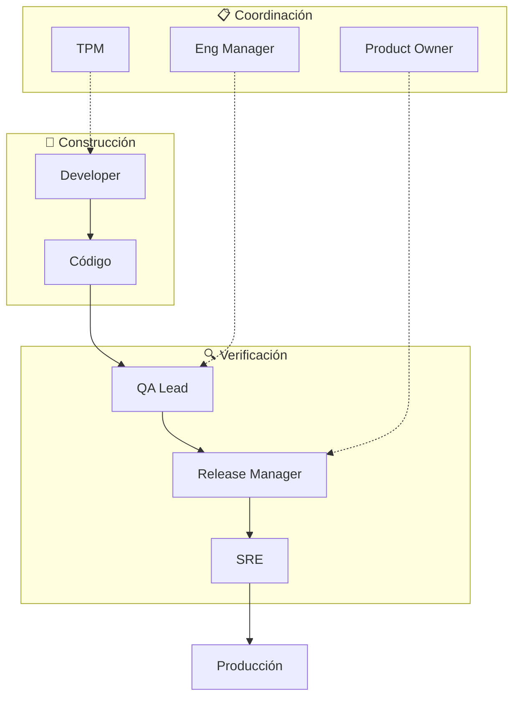
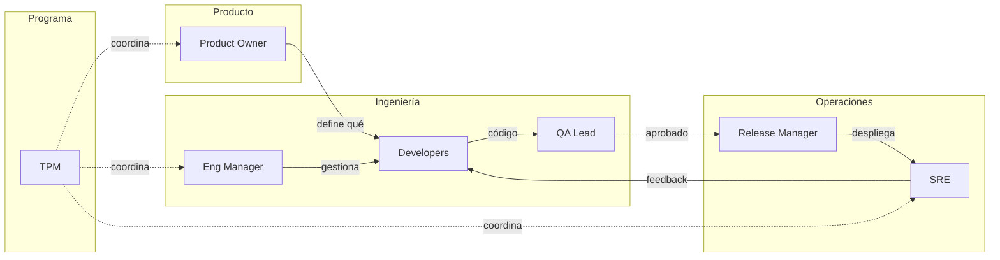

# Roles de Verificación y Supervisión en Software — Índice de la Serie

> Esta serie explora los roles profesionales responsables de garantizar que el software se construya correctamente, se entregue a tiempo y funcione en producción. Dirigida a desarrolladores que quieren entender el ecosistema de roles más allá del código.

---

## Documentos de esta Serie

| #   | Documento                  | Tema                                                    |
| --- | -------------------------- | ------------------------------------------------------- |
| 01  | `01-fundamentos.md`        | Por qué existen estos roles y cómo evolucionaron        |
| 02  | `02-roles-tecnicos.md`     | QA Lead, SRE, Release Manager — roles técnicos          |
| 03  | `03-roles-gestion.md`      | TPM, Engineering Manager, PO — roles de coordinación    |
| 04  | `04-equipos-pequenos.md`   | Cómo consolidar roles en startups y equipos pequeños    |
| 05  | `05-procesos-auditoria.md` | Feature audits, code reviews, release gates en práctica |

---

## Resumen Ejecutivo

### ¿Qué Aprenderás?

1. **Por qué existen roles de verificación** — El costo de los bugs en producción y la evolución histórica de QA
2. **Qué hace cada rol** — Responsabilidades concretas, herramientas, y cómo interactúan entre sí
3. **Roles técnicos vs roles de gestión** — La diferencia entre verificar código y verificar entregas
4. **Cómo escalar** — Desde un solo desarrollador hasta equipos de 100+ personas
5. **Procesos concretos** — Code reviews, feature audits, release gates, post-mortems
6. **Cuándo contratar cada rol** — Señales de que necesitas un QA, un TPM, o un SRE

### Principios Fundamentales

**Los tres pilares de la verificación:**

| Pilar         | Pregunta que responde     | Roles involucrados       |
| ------------- | ------------------------- | ------------------------ |
| **Calidad**   | ¿Funciona correctamente?  | QA Lead, Developer       |
| **Entrega**   | ¿Se entregó lo prometido? | TPM, PO, Release Manager |
| **Operación** | ¿Funciona en producción?  | SRE, Engineering Manager |

---

## Glosario Rápido

| Término                                | Definición                                                                    |
| -------------------------------------- | ----------------------------------------------------------------------------- |
| **QA (Quality Assurance)**             | Proceso sistemático de verificar que el software cumple requisitos de calidad |
| **SRE (Site Reliability Engineering)** | Disciplina que aplica ingeniería de software a problemas de operaciones       |
| **TPM (Technical Program Manager)**    | Rol que coordina proyectos técnicos complejos entre múltiples equipos         |
| **PO (Product Owner)**                 | Responsable de maximizar el valor del producto y gestionar el backlog         |
| **Release Gate**                       | Punto de control que debe pasarse antes de desplegar a producción             |
| **Post-mortem**                        | Análisis retrospectivo de un incidente para prevenir recurrencia              |
| **Feature Flag**                       | Técnica para habilitar/deshabilitar funcionalidades sin deploy                |
| **SLA (Service Level Agreement)**      | Acuerdo de nivel de servicio con métricas comprometidas                       |
| **SLO (Service Level Objective)**      | Objetivo interno de nivel de servicio                                         |
| **MTTR (Mean Time To Recovery)**       | Tiempo promedio para recuperarse de un fallo                                  |
| **Code Review**                        | Proceso de revisión de código por pares antes de merge                        |
| **Smoke Test**                         | Prueba rápida para verificar funcionalidad básica                             |
| **Regression**                         | Bug introducido al modificar código existente                                 |
| **Rollback**                           | Revertir un deploy a una versión anterior                                     |
| **Canary Deploy**                      | Desplegar a un porcentaje pequeño de usuarios primero                         |

---

## Mapa de Interacciones entre Roles

---

## Evolución de Roles por Tamaño de Empresa

| Etapa                    | Tamaño    | Roles típicos                   | Quién hace QA         |
| ------------------------ | --------- | ------------------------------- | --------------------- |
| **Solo founder**         | 1 persona | Todo                            | El developer          |
| **Startup temprana**     | 2-5       | Developers + PO informal        | Developers + usuarios |
| **Startup con tracción** | 5-15      | + QA dedicado, + DevOps         | QA Lead               |
| **Scale-up**             | 15-50     | + TPM, + SRE, + EM              | Equipo QA             |
| **Empresa establecida**  | 50-200    | Todos los roles definidos       | Departamento QA       |
| **Enterprise**           | 200+      | Equipos especializados por área | Múltiples equipos QA  |

---

## Cómo Usar Esta Serie

### Para Principiantes

Leer en orden:

1. **01-fundamentos.md** — Contexto histórico y por qué importa
2. **02-roles-tecnicos.md** — Los roles más cercanos al código
3. **03-roles-gestion.md** — Los roles de coordinación
4. **04-equipos-pequenos.md** — Cómo aplicarlo si sos solo o pocos
5. **05-procesos-auditoria.md** — Procesos concretos a implementar

### Para Referencia Rápida

- **"¿Qué hace un TPM?"** → `03-roles-gestion.md`, sección TPM
- **"¿Necesito un QA?"** → `04-equipos-pequenos.md`, sección de señales
- **"¿Cómo hago un feature audit?"** → `05-procesos-auditoria.md`
- **"¿Qué herramientas usa un SRE?"** → `02-roles-tecnicos.md`, sección SRE

### Para Audio (NotebookLM)

Usar los prompts en `prompts-notebooklm.md` para generar podcasts por tema o un episodio completo de la serie.

---

## Referencias Externas Recomendadas

| Recurso                                  | Tipo   | Tema                      |
| ---------------------------------------- | ------ | ------------------------- |
| "The Site Reliability Workbook" (Google) | Libro  | SRE en profundidad        |
| "Accelerate" (Forsgren, Humble, Kim)     | Libro  | Métricas de DevOps        |
| "The Phoenix Project"                    | Novela | DevOps y flujo de trabajo |
| "Inspired" (Marty Cagan)                 | Libro  | Rol del Product Owner     |
| "An Elegant Puzzle" (Will Larson)        | Libro  | Engineering Management    |
| "Software Engineering at Google"         | Libro  | Prácticas a escala        |

---

## Audiencia de Esta Serie

Esta serie está diseñada para:

- **Developers** que quieren entender el ecosistema más allá del código
- **Tech leads** considerando crecer hacia roles de gestión
- **Founders técnicos** decidiendo cuándo contratar estos roles
- **QA engineers** buscando entender cómo encajan en el equipo
- **Product managers** queriendo colaborar mejor con ingeniería

No es para:

- Personas buscando certificaciones específicas (PMP, ISTQB)
- Gestión no técnica sin contexto de desarrollo
- Especialización profunda en un solo rol (esta es una visión general)

---

## Referencia Rápida

### Los 6 Roles Principales

| Rol                     | Foco                        | Bloquea Releases     | Herramienta Típica      |
| ----------------------- | --------------------------- | -------------------- | ----------------------- |
| **QA Lead**             | Calidad del producto        | Sí                   | TestRail, Jira          |
| **SRE**                 | Confiabilidad en producción | Sí                   | Datadog, PagerDuty      |
| **Release Manager**     | Proceso de deploy           | Sí                   | Jenkins, GitHub Actions |
| **TPM**                 | Coordinación de programa    | No (escala)          | Asana, hojas de cálculo |
| **Engineering Manager** | Equipo y calidad técnica    | Puede vetar          | GitHub, 1:1s            |
| **Product Owner**       | Valor al usuario            | Sí (acepta features) | Jira, Figma             |

### Preguntas Clave por Rol

| Rol             | Pregunta que hace constantemente                    |
| --------------- | --------------------------------------------------- |
| QA Lead         | "¿Los tests cubren los criterios de aceptación?"    |
| SRE             | "¿Cuál es el impacto en latencia y disponibilidad?" |
| Release Manager | "¿Está listo para producción?"                      |
| TPM             | "¿Estamos en track para la fecha comprometida?"     |
| Eng Manager     | "¿El equipo tiene lo que necesita para entregar?"   |
| PO              | "¿Esto resuelve el problema del usuario?"           |
