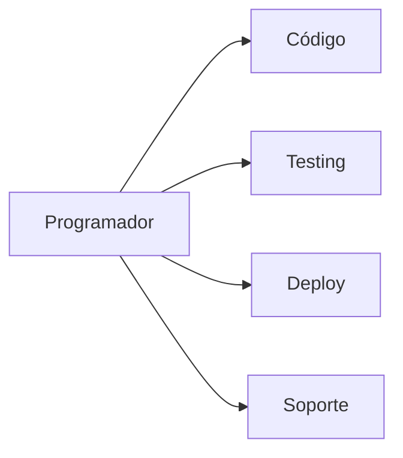
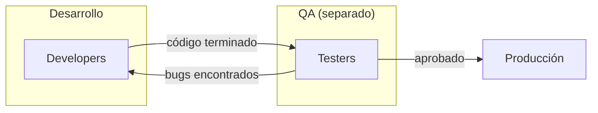
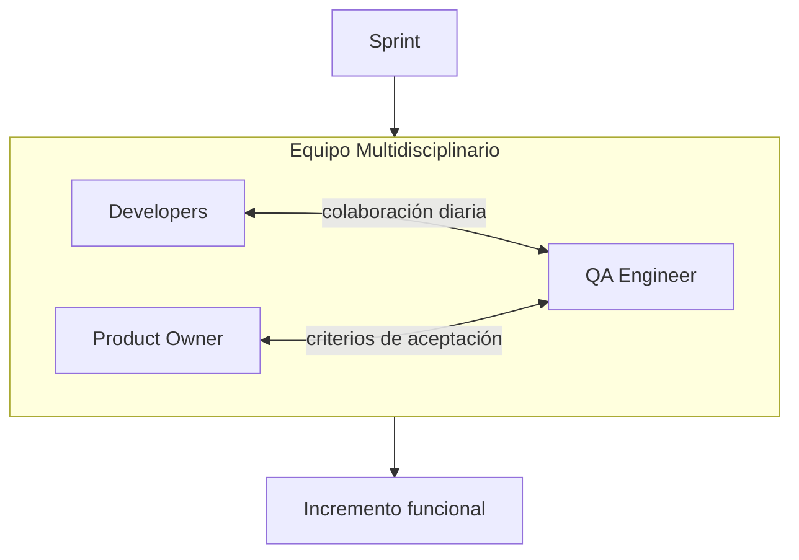
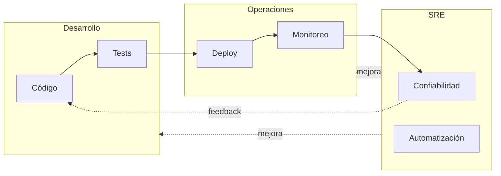
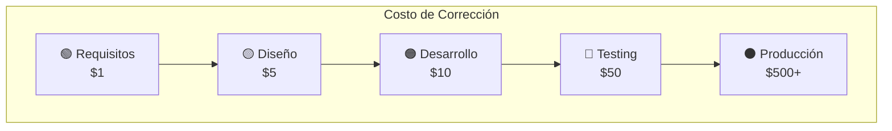
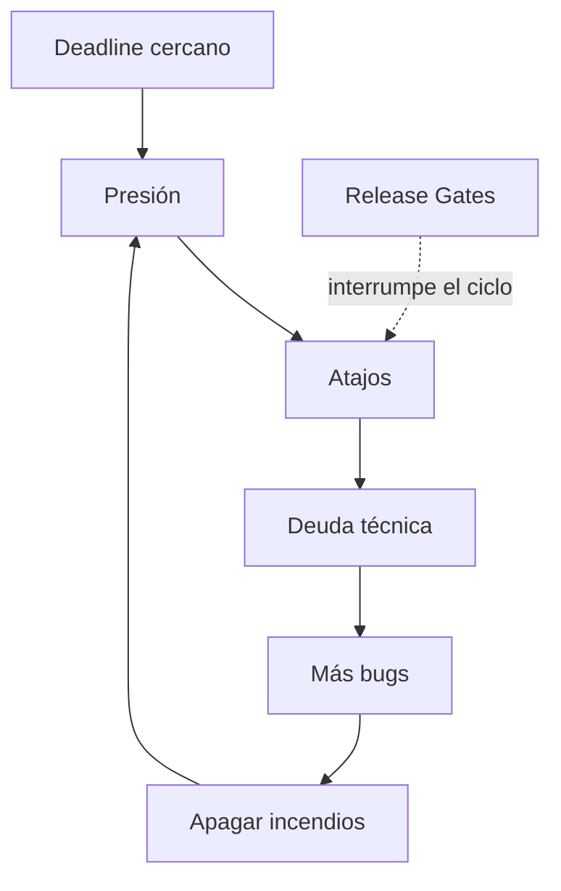
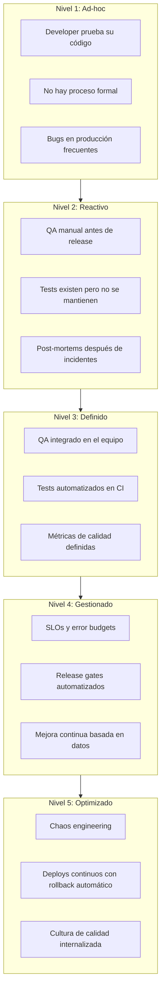

# Por Qué Existen los Roles de Verificación

> Este documento explica el origen histórico de los roles de verificación en software, por qué surgieron, y el costo real de no tenerlos. Entender el "por qué" ayuda a decidir cuándo y cómo implementarlos.

---

## El Problema Fundamental

El software tiene una característica única entre los productos de ingeniería: **el costo de un error puede ser casi cero o catastrófico**, dependiendo de cuándo se descubre.

```
┌─────────────────────────────────────────────────────────────────────┐
│                    COSTO DE CORREGIR UN BUG                         │
│                                                                     │
│  Producción    ████████████████████████████████████████  100x       │
│  QA/Testing    ████████████████████                      15x        │
│  Code Review   ████████████                              6x         │
│  Desarrollo    ████                                      1x         │
│                                                                     │
│  Fuente: IBM Systems Science Institute, estudios posteriores        │
└─────────────────────────────────────────────────────────────────────┘
```

Esta curva exponencial explica por qué existen roles dedicados a encontrar problemas **antes** de que lleguen a producción.

---

## Historia de la Verificación en Software

### Era 1: El Programador Hace Todo (1950s-1970s)

En los primeros días de la computación, el mismo equipo que escribía el código lo probaba. No existía separación de roles porque:

- Los equipos eran pequeños (2-10 personas)
- El software era relativamente simple
- Los usuarios eran técnicos (científicos, militares)
- No había "producción" 24/7



**Problema emergente:** A medida que el software creció, los programadores no podían hacer todo. Los bugs se escapaban porque el mismo cerebro que escribió el código lo revisaba.

### Era 2: QA como Departamento Separado (1980s-1990s)

La industria adoptó el modelo de manufactura: separar construcción de inspección.



**Características:**

- QA era un departamento separado, a menudo en otro piso o edificio
- Los testers recibían el código "terminado" y buscaban bugs
- Existía tensión entre "desarrollo" y "QA"
- El ciclo de feedback era lento (semanas o meses)

**Problema emergente:** El modelo "throw it over the wall" creaba:

- Bugs descubiertos tarde (costosos)
- Developers que no aprendían de sus errores
- QA visto como "bloqueador" en lugar de aliado

### Era 3: Agile y QA Integrado (2000s-2010s)

El movimiento ágil integró QA al equipo de desarrollo.



**Cambios clave:**

- QA participa desde el inicio del sprint
- Los criterios de aceptación se definen antes de codear
- Testing automatizado se vuelve norma
- El rol de QA evoluciona de "encontrar bugs" a "prevenir bugs"

### Era 4: DevOps y SRE (2010s-presente)

Google formalizó Site Reliability Engineering (SRE). La verificación se extendió a producción.



**Principio clave:** "You build it, you run it" — los developers son responsables de su código en producción, pero SRE provee las herramientas y prácticas.

---

## El Costo Real de los Bugs

### Caso de Estudio: Knight Capital (2012)

```
┌─────────────────────────────────────────────────────────────────────┐
│  KNIGHT CAPITAL — 1 de Agosto de 2012                               │
│                                                                     │
│  Qué pasó:                                                          │
│  - Deploy de código nuevo que reactivó código viejo                 │
│  - El código viejo ejecutó millones de trades erróneos              │
│  - 45 minutos de operación antes de detectarlo                      │
│                                                                     │
│  Resultado:                                                         │
│  - Pérdida de $440 millones de dólares                              │
│  - Bancarrota de la empresa                                         │
│  - 400+ empleados perdieron su trabajo                              │
│                                                                     │
│  Qué faltó:                                                         │
│  - Release gates claros                                             │
│  - Monitoreo de anomalías                                           │
│  - Proceso de rollback automatizado                                 │
│  - Verificación de que código viejo estaba desactivado              │
└─────────────────────────────────────────────────────────────────────┘
```

### Caso de Estudio: Therac-25 (1985-1987)

```
┌─────────────────────────────────────────────────────────────────────┐
│  THERAC-25 — Máquina de radioterapia                                │
│                                                                     │
│  Qué pasó:                                                          │
│  - Race condition en el software de control                         │
│  - Permitía dosis de radiación 100x mayores a las programadas       │
│  - 6 accidentes, 3 muertes                                          │
│                                                                     │
│  Qué faltó:                                                         │
│  - Testing independiente del software                               │
│  - Revisión de código por terceros                                  │
│  - Hardware de seguridad redundante                                 │
│  - QA que entendiera el dominio médico                              │
└─────────────────────────────────────────────────────────────────────┘
```

### La Pirámide del Costo



| Etapa      | Costo relativo | Ejemplo concreto                                            |
| ---------- | -------------- | ----------------------------------------------------------- |
| Requisitos | 1x             | "Ah, necesitábamos validar emails" — cambiar spec           |
| Diseño     | 5x             | "La arquitectura no soporta esto" — rediseñar               |
| Desarrollo | 10x            | "El código no maneja este caso" — reescribir                |
| Testing    | 50x            | "Encontramos el bug en QA" — fix + retest                   |
| Producción | 500x+          | "Los usuarios perdieron datos" — fix + soporte + reputación |

---

## Por Qué No Alcanza con "Buenos Developers"

### El Problema del Sesgo del Creador

```
❌ Lo que pensamos:
"Soy un buen developer, puedo probar mi propio código"

✅ La realidad:
El cerebro que escribió el código tiene puntos ciegos sobre ese código
```

**Experimento mental:**

```typescript
// Escribiste esta función
function dividir(a: number, b: number): number {
  return a / b;
}

// ¿Qué casos probaste mentalmente mientras la escribías?
// Probablemente: dividir(10, 2) → 5 ✓
//
// ¿Qué casos NO pensaste?
// - dividir(10, 0) → Infinity (¿es correcto?)
// - dividir(0, 0) → NaN
// - dividir(1.5, 0.3) → 5.000000000000001 (floating point)
// - dividir(Number.MAX_VALUE, 0.5) → Infinity
// - dividir("10", 2) → 5 (coerción de tipos)
```

Un QA o reviewer que **no escribió el código** piensa en casos que el autor no consideró.

### El Problema de la Presión de Entrega



Los roles de verificación actúan como **circuit breakers** que impiden que la presión de entrega se traduzca en bugs en producción.

### El Problema de la Escala

```
┌─────────────────────────────────────────────────────────────────────┐
│  COMPLEJIDAD vs TAMAÑO DE EQUIPO                                    │
│                                                                     │
│  Personas    Canales de comunicación    Complejidad                 │
│  ─────────   ───────────────────────    ───────────                 │
│      2              1                   Manejable                   │
│      5             10                   Requiere procesos           │
│     10             45                   Requiere roles dedicados    │
│     20            190                   Requiere jerarquía          │
│     50           1225                   Requiere departamentos      │
│                                                                     │
│  Fórmula: n(n-1)/2 donde n = número de personas                     │
└─────────────────────────────────────────────────────────────────────┘
```

A medida que el equipo crece, se necesitan roles dedicados a:

- **Verificar calidad** (QA) porque hay demasiado código para que todos lo revisen
- **Coordinar entregas** (TPM) porque hay demasiadas dependencias
- **Mantener producción** (SRE) porque el sistema es demasiado complejo

---

## Los Tres Tipos de Verificación

### 1. Verificación de Construcción (QA tradicional)

**Pregunta:** ¿El código hace lo que se supone que debe hacer?

```typescript
// Criterio de aceptación:
// "El usuario puede registrarse con email y password"

// Test de verificación:
describe('Registro de usuario', () => {
  it('permite registro con email válido', async () => {
    const response = await request(app)
      .post('/api/register')
      .send({ email: 'test@example.com', password: 'secure123' });

    expect(response.status).toBe(201);
    expect(response.body.user.email).toBe('test@example.com');
  });

  it('rechaza email inválido', async () => {
    const response = await request(app)
      .post('/api/register')
      .send({ email: 'not-an-email', password: 'secure123' });

    expect(response.status).toBe(400);
  });
});
```

**Roles involucrados:** QA Lead, Developers (tests unitarios), Product Owner (criterios)

### 2. Verificación de Entrega (Program Management)

**Pregunta:** ¿Se entregó lo prometido en el tiempo acordado?

```
┌─────────────────────────────────────────────────────────────────────┐
│  TRACKING DE ENTREGA — Sprint 5                                     │
│                                                                     │
│  Comprometido          Entregado            Estado                  │
│  ────────────          ─────────            ──────                  │
│  Feature A             Feature A            ✅ Completo             │
│  Feature B             Feature B (parcial)  ⚠️ 70% done             │
│  Feature C             —                    ❌ No iniciado          │
│  Bug fix X             Bug fix X            ✅ Completo             │
│                                                                     │
│  Velocidad comprometida: 21 puntos                                  │
│  Velocidad real: 14 puntos (67%)                                    │
│  Acción: Reducir scope del próximo sprint                           │
└─────────────────────────────────────────────────────────────────────┘
```

**Roles involucrados:** TPM, Product Owner, Engineering Manager

### 3. Verificación de Operación (SRE)

**Pregunta:** ¿El sistema funciona correctamente en producción?

```typescript
// Monitoreo de SLOs
const slos = {
  availability: {
    target: 99.9, // 99.9% uptime
    current: 99.95, // ✅ Cumpliendo
    budget_remaining: '4h', // Podemos tener 4h de downtime este mes
  },
  latency: {
    target_p99: 200, // 200ms en percentil 99
    current_p99: 180, // ✅ Cumpliendo
  },
  error_rate: {
    target: 0.1, // 0.1% de errores
    current: 0.08, // ✅ Cumpliendo
  },
};

// Alerta cuando nos acercamos al límite
if (slos.availability.budget_remaining < '1h') {
  alert('Error budget casi agotado — congelar deploys');
}
```

**Roles involucrados:** SRE, Release Manager, On-call engineers

---

## El Modelo de Madurez



| Nivel | Característica         | Roles típicos           |
| ----- | ---------------------- | ----------------------- |
| 1     | Sin proceso            | Solo developers         |
| 2     | Proceso manual         | + QA manual             |
| 3     | Proceso automatizado   | + QA Lead, + CI/CD      |
| 4     | Proceso medido         | + SRE, + TPM            |
| 5     | Proceso auto-mejorable | Todos los roles maduros |

---

## Cuándo Agregar Cada Rol

### Señales de que Necesitas un QA Dedicado

```
□ Los mismos bugs aparecen repetidamente
□ Los developers no tienen tiempo de escribir tests
□ Los usuarios encuentran bugs obvios
□ No hay criterios de aceptación claros
□ El código va a producción sin revisión sistemática
```

### Señales de que Necesitas un SRE

```
□ Incidentes en producción son frecuentes (>1/semana)
□ No sabes cuándo el sistema está degradado
□ Los deploys son manuales y riesgosos
□ No hay runbooks para incidentes comunes
□ El on-call es caótico y estresante
```

### Señales de que Necesitas un TPM

```
□ Los proyectos se retrasan constantemente
□ No hay visibilidad del estado real de las entregas
□ Las dependencias entre equipos causan bloqueos
□ Los stakeholders están frustrados con la comunicación
□ Nadie sabe quién es responsable de qué
```

---

## Referencia Rápida

### Timeline Histórico

| Década    | Paradigma dominante      | Rol de QA                |
| --------- | ------------------------ | ------------------------ |
| 1950s-70s | Programador hace todo    | No existe                |
| 1980s-90s | QA departamento separado | Inspector al final       |
| 2000s     | Agile                    | Integrado al equipo      |
| 2010s+    | DevOps/SRE               | Parte del ciclo completo |

### Costo de Bugs por Etapa

| Etapa      | Multiplicador | Ejemplo                    |
| ---------- | ------------- | -------------------------- |
| Requisitos | 1x            | Cambiar documentación      |
| Diseño     | 5x            | Rediseñar arquitectura     |
| Desarrollo | 10x           | Reescribir código          |
| Testing    | 50x           | Fix + regression testing   |
| Producción | 500x+         | Fix + soporte + reputación |

### Preguntas por Tipo de Verificación

| Tipo         | Pregunta central | Métrica clave             |
| ------------ | ---------------- | ------------------------- |
| Construcción | ¿Funciona?       | % tests pasando           |
| Entrega      | ¿Se entregó?     | Velocity vs comprometido  |
| Operación    | ¿Está estable?   | Uptime, latencia, errores |

### Los Tres Pilares

```
CALIDAD ←→ ENTREGA ←→ OPERACIÓN
   ↓          ↓          ↓
  QA         TPM        SRE
```

Ninguno puede sacrificarse permanentemente sin consecuencias.
