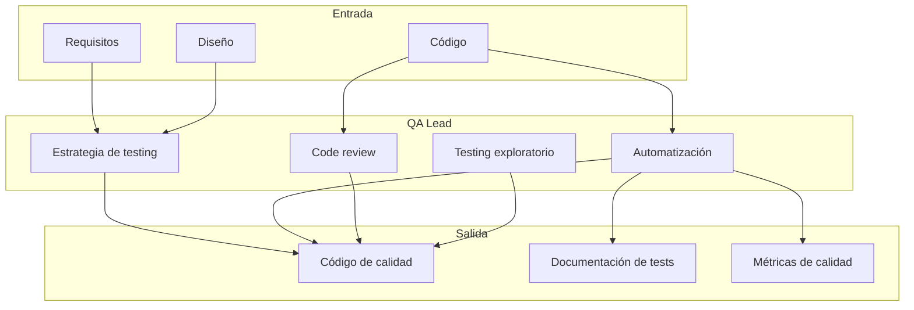
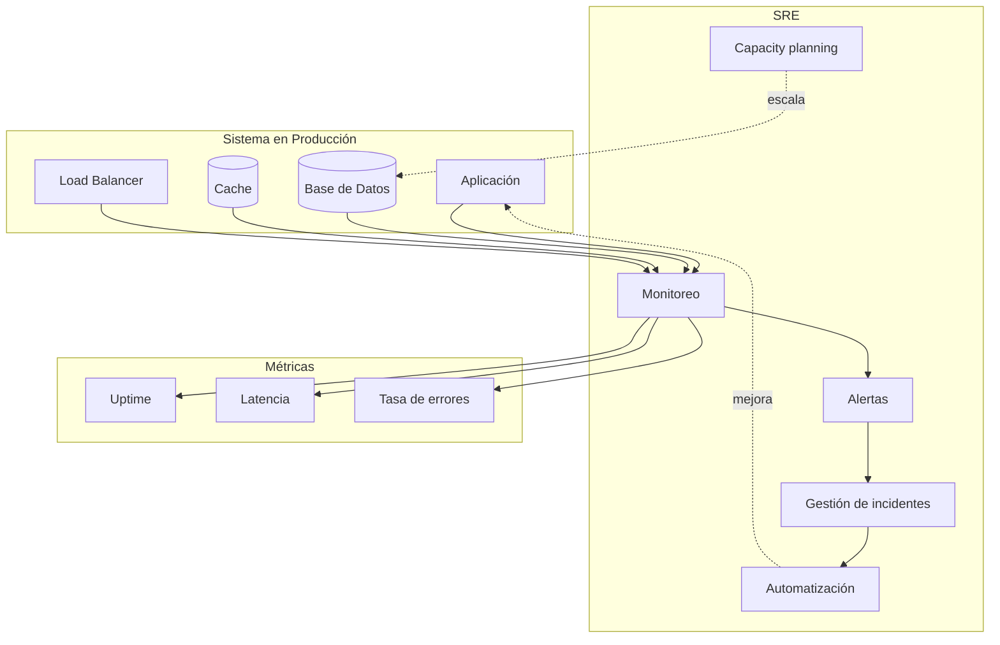
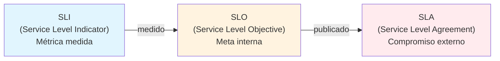
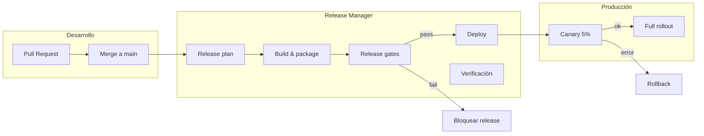
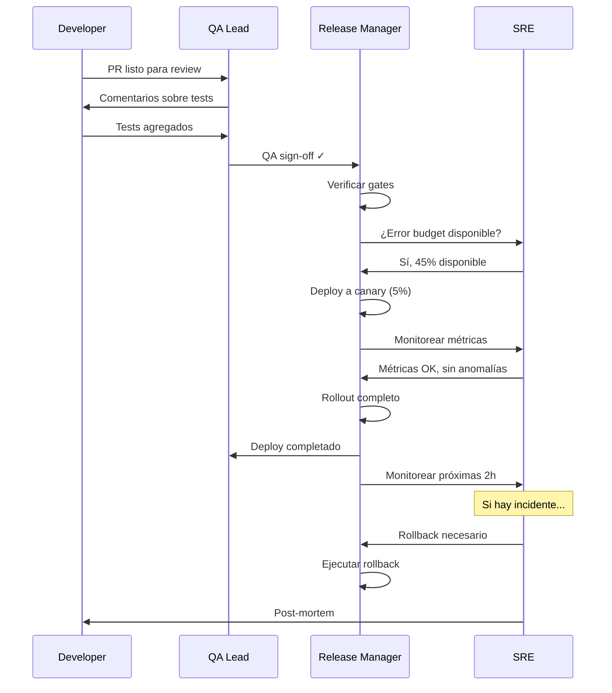

# Roles Técnicos de Verificación: QA Lead, SRE, Release Manager

> Este documento profundiza en los tres roles técnicos principales de verificación: QA Lead (calidad del código), SRE (confiabilidad en producción), y Release Manager (proceso de despliegue). Incluye responsabilidades, herramientas, y cómo interactúan.

---

## QA Lead (Quality Assurance Lead)

### Definición

El QA Lead es responsable de **garantizar que el software cumple con los requisitos de calidad** antes de llegar a producción. No es solo "el que encuentra bugs" — es quien diseña e implementa la estrategia de calidad del equipo.



### Responsabilidades Concretas

| Área               | Responsabilidad                         | Entregable                |
| ------------------ | --------------------------------------- | ------------------------- |
| **Estrategia**     | Definir qué testear y cómo              | Test plan por feature     |
| **Automatización** | Escribir y mantener tests automatizados | Suite de tests en CI      |
| **Revisión**       | Participar en code reviews              | Comentarios sobre calidad |
| **Exploración**    | Testing manual de casos edge            | Bugs reportados           |
| **Métricas**       | Medir y reportar calidad                | Dashboard de cobertura    |
| **Proceso**        | Definir criterios de aceptación         | Definition of Done        |

### Un Día Típico

```
09:00  Stand-up — Escuchar qué features están en progreso
09:30  Review de PRs — Buscar casos no testeados
11:00  Escribir tests para feature nueva
13:00  Almuerzo
14:00  Testing exploratorio en ambiente de staging
15:30  Reunión con PO — Clarificar criterios de aceptación
16:30  Actualizar dashboard de métricas
17:00  Documentar bugs encontrados en Jira
```

### Herramientas del QA Lead

| Categoría           | Herramientas                | Propósito                      |
| ------------------- | --------------------------- | ------------------------------ |
| **Test Management** | TestRail, Zephyr, qTest     | Organizar casos de test        |
| **Bug Tracking**    | Jira, Linear, GitHub Issues | Reportar y trackear bugs       |
| **Automatización**  | Jest, Playwright, Cypress   | Tests automatizados            |
| **API Testing**     | Postman, Insomnia, Bruno    | Tests de endpoints             |
| **CI/CD**           | GitHub Actions, Jenkins     | Ejecutar tests automáticamente |
| **Cobertura**       | Istanbul, Codecov           | Medir cobertura de código      |

### Ejemplo: Test Plan para Feature de Login

```markdown
## Test Plan: Autenticación de Usuario

### Scope

- Login con email/password
- Registro de nuevo usuario
- Recuperación de password
- Logout

### Casos de Test

#### Login (Crítico)

| ID  | Caso                | Input                    | Resultado Esperado    | Automatizado |
| --- | ------------------- | ------------------------ | --------------------- | ------------ |
| L1  | Login válido        | email+pass válidos       | 200, token JWT        | ✅           |
| L2  | Password incorrecto | email válido, pass mal   | 401, mensaje error    | ✅           |
| L3  | Usuario no existe   | email no registrado      | 401, mensaje genérico | ✅           |
| L4  | Email inválido      | "not-an-email"           | 400, validación       | ✅           |
| L5  | Rate limiting       | 10 intentos fallidos     | 429, bloqueo temporal | ✅           |
| L6  | SQL injection       | email: "'; DROP TABLE--" | 400, sanitizado       | ✅           |
| L7  | XSS en email        | email: "<script>..."     | 400, sanitizado       | ✅           |

#### Registro

| ID  | Caso            | Input           | Resultado Esperado  | Automatizado |
| --- | --------------- | --------------- | ------------------- | ------------ |
| R1  | Registro válido | datos completos | 201, usuario creado | ✅           |
| R2  | Email duplicado | email existente | 409, mensaje error  | ✅           |
| R3  | Password débil  | "123"           | 400, requisitos     | ✅           |

### Criterios de Aceptación

- [ ] Todos los tests automatizados pasan en CI
- [ ] Cobertura >80% en módulo auth
- [ ] Testing exploratorio completado sin bugs críticos
- [ ] Performance: login <200ms p99
```

### Código de Test Ejemplo

```typescript
// tests/auth/login.spec.ts
import { test, expect } from '@playwright/test';

test.describe('Login', () => {
  test('usuario puede hacer login con credenciales válidas', async ({
    page,
  }) => {
    // Arrange
    await page.goto('/login');

    // Act
    await page.fill('[data-testid="email"]', 'usuario@example.com');
    await page.fill('[data-testid="password"]', 'password123');
    await page.click('[data-testid="submit"]');

    // Assert
    await expect(page).toHaveURL('/dashboard');
    await expect(page.locator('[data-testid="user-menu"]')).toBeVisible();
  });

  test('muestra error con password incorrecto', async ({ page }) => {
    await page.goto('/login');

    await page.fill('[data-testid="email"]', 'usuario@example.com');
    await page.fill('[data-testid="password"]', 'wrong-password');
    await page.click('[data-testid="submit"]');

    await expect(page.locator('[data-testid="error-message"]')).toContainText(
      'Credenciales inválidas'
    );
    await expect(page).toHaveURL('/login'); // No navega
  });

  test('bloquea después de múltiples intentos fallidos', async ({ page }) => {
    await page.goto('/login');

    // 5 intentos fallidos
    for (let i = 0; i < 5; i++) {
      await page.fill('[data-testid="email"]', 'usuario@example.com');
      await page.fill('[data-testid="password"]', 'wrong');
      await page.click('[data-testid="submit"]');
      await page.waitForTimeout(500);
    }

    await expect(page.locator('[data-testid="error-message"]')).toContainText(
      'Demasiados intentos'
    );
  });
});
```

### Métricas que Mide el QA Lead

```
┌─────────────────────────────────────────────────────────────────────┐
│  DASHBOARD DE CALIDAD — Semana 12                                   │
│                                                                     │
│  Cobertura de Código                                                │
│  ├── Statements: 87% ████████████████████░░░                        │
│  ├── Branches:   72% ██████████████████░░░░░                        │
│  ├── Functions:  91% ███████████████████████░                       │
│  └── Lines:      85% █████████████████████░░░                       │
│                                                                     │
│  Bugs por Severidad (últimos 30 días)                               │
│  ├── Críticos:   2  (meta: <5)  ✅                                  │
│  ├── Mayores:    8  (meta: <15) ✅                                  │
│  ├── Menores:   15  (meta: <30) ✅                                  │
│  └── Triviales: 23                                                  │
│                                                                     │
│  Tiempo de Resolución de Bugs                                       │
│  ├── Críticos: 4h promedio   (meta: <8h)  ✅                        │
│  ├── Mayores:  2d promedio   (meta: <3d)  ✅                        │
│  └── Menores:  5d promedio   (meta: <7d)  ✅                        │
│                                                                     │
│  Tests en CI                                                        │
│  ├── Pasando:    342/350 (97.7%)                                    │
│  ├── Flaky:      8 tests identificados                              │
│  └── Tiempo CI:  4m 32s                                             │
└─────────────────────────────────────────────────────────────────────┘
```

---

## SRE (Site Reliability Engineer)

### Definición

El SRE es responsable de **garantizar que el sistema funcione correctamente en producción**. Combina habilidades de desarrollo con operaciones, aplicando ingeniería de software a problemas de infraestructura.



### Responsabilidades Concretas

| Área               | Responsabilidad                           | Entregable                 |
| ------------------ | ----------------------------------------- | -------------------------- |
| **Monitoreo**      | Instrumentar y observar sistemas          | Dashboards, alertas        |
| **Incidentes**     | Responder y resolver problemas            | Runbooks, post-mortems     |
| **SLOs**           | Definir y medir objetivos de servicio     | SLO dashboard              |
| **Automatización** | Eliminar toil (trabajo manual repetitivo) | Scripts, herramientas      |
| **Capacity**       | Planificar crecimiento                    | Proyecciones, escalado     |
| **Reliability**    | Mejorar resiliencia del sistema           | Chaos testing, redundancia |

### SLIs, SLOs y SLAs



**Ejemplo concreto:**

| Concepto | Ejemplo                                             |
| -------- | --------------------------------------------------- |
| **SLI**  | Porcentaje de requests que responden en <200ms      |
| **SLO**  | 99% de requests deben responder en <200ms           |
| **SLA**  | "Garantizamos 99% de uptime o devolvemos el dinero" |

### Error Budget

El concepto más importante de SRE: **presupuesto de errores**.

```
┌─────────────────────────────────────────────────────────────────────┐
│  ERROR BUDGET — Marzo 2024                                          │
│                                                                     │
│  SLO de disponibilidad: 99.9%                                       │
│  Minutos totales en el mes: 43,200                                  │
│  Downtime permitido: 43.2 minutos                                   │
│                                                                     │
│  Downtime usado:                                                    │
│  ├── Incidente del 5/3:  12 min                                     │
│  ├── Deploy fallido 12/3: 8 min                                     │
│  ├── Incidente del 20/3: 15 min                                     │
│  └── Total usado:        35 min                                     │
│                                                                     │
│  Budget restante: 8.2 min (19%)                                     │
│                                                                     │
│  ⚠️ Acción: Reducir deploys riesgosos hasta fin de mes              │
└─────────────────────────────────────────────────────────────────────┘
```

**Filosofía:**

- Si hay budget disponible → se puede tomar más riesgo (más deploys, más features)
- Si el budget se agota → congelar cambios, enfocarse en estabilidad

### Herramientas del SRE

| Categoría           | Herramientas                   | Propósito              |
| ------------------- | ------------------------------ | ---------------------- |
| **Monitoreo**       | Datadog, Grafana, Prometheus   | Visualizar métricas    |
| **Alertas**         | PagerDuty, OpsGenie, VictorOps | Notificar on-call      |
| **Logs**            | ELK Stack, Loki, Splunk        | Analizar logs          |
| **Tracing**         | Jaeger, Zipkin, Honeycomb      | Trazar requests        |
| **Infraestructura** | Terraform, Pulumi              | Infrastructure as Code |
| **Orquestación**    | Kubernetes, Docker Swarm       | Gestionar containers   |
| **CI/CD**           | ArgoCD, Spinnaker              | Deploys automatizados  |

### Ejemplo: Runbook para Incidente de Base de Datos

````markdown
# Runbook: Base de Datos No Responde

## Síntomas

- Alertas: "PostgreSQL connection timeout"
- Usuarios reportan errores 500
- Dashboard muestra queries lentas o fallidas

## Severidad

- **P1** si afecta >50% de usuarios
- **P2** si afecta <50% de usuarios
- **P3** si solo afecta operaciones internas

## Pasos de Diagnóstico

### 1. Verificar conectividad básica

```bash
# Desde servidor de aplicación
psql -h $DB_HOST -U $DB_USER -c "SELECT 1"

# Si falla, verificar red
ping $DB_HOST
telnet $DB_HOST 5432
```
````

### 2. Verificar recursos del servidor de DB

```bash
# CPU y memoria
ssh db-server "top -bn1 | head -20"

# Disco
ssh db-server "df -h"

# Conexiones activas
psql -c "SELECT count(*) FROM pg_stat_activity"
```

### 3. Buscar queries problemáticas

```sql
-- Queries lentas activas
SELECT pid, now() - pg_stat_activity.query_start AS duration, query
FROM pg_stat_activity
WHERE state != 'idle'
ORDER BY duration DESC
LIMIT 10;

-- Bloqueos
SELECT * FROM pg_locks WHERE NOT granted;
```

## Acciones de Mitigación

### Si hay queries bloqueadas

```sql
-- Cancelar query específica
SELECT pg_cancel_backend(PID);

-- Si no responde, terminar
SELECT pg_terminate_backend(PID);
```

### Si el disco está lleno

```bash
# Identificar qué consume espacio
du -sh /var/lib/postgresql/*

# Vaciar WAL logs si es seguro
pg_archivecleanup /var/lib/postgresql/pg_wal OLDEST_WAL_TO_KEEP
```

### Si hay demasiadas conexiones

```bash
# Reiniciar pool de conexiones (PgBouncer)
systemctl restart pgbouncer
```

## Escalación

- Si no se resuelve en 15 min → llamar a DBA on-call
- Si afecta SLA → notificar a Engineering Manager

````

### Código de Monitoreo Ejemplo

```typescript
// monitoring/slo-calculator.ts
interface SLOConfig {
  name: string;
  target: number;
  window: 'daily' | 'weekly' | 'monthly';
}

interface SLOResult {
  name: string;
  current: number;
  target: number;
  status: 'ok' | 'warning' | 'critical';
  errorBudgetRemaining: number;
}

async function calculateSLO(config: SLOConfig): Promise<SLOResult> {
  const metrics = await fetchMetricsFromPrometheus(config.name, config.window);

  const current = metrics.successRate;
  const target = config.target;

  // Error budget: cuánto podemos fallar y aún cumplir el SLO
  const errorBudgetTotal = 100 - target; // ej: 0.1% para 99.9%
  const errorBudgetUsed = 100 - current;
  const errorBudgetRemaining = ((errorBudgetTotal - errorBudgetUsed) / errorBudgetTotal) * 100;

  let status: 'ok' | 'warning' | 'critical';
  if (current >= target) {
    status = 'ok';
  } else if (errorBudgetRemaining > 0) {
    status = 'warning';
  } else {
    status = 'critical';
  }

  return {
    name: config.name,
    current,
    target,
    status,
    errorBudgetRemaining,
  };
}

// Uso
const availabilitySLO = await calculateSLO({
  name: 'http_requests_success_rate',
  target: 99.9,
  window: 'monthly',
});

if (availabilitySLO.status === 'critical') {
  await sendAlert({
    severity: 'P1',
    message: `SLO ${availabilitySLO.name} violado: ${availabilitySLO.current}% < ${availabilitySLO.target}%`,
    runbook: 'https://wiki/runbooks/slo-violation',
  });
}
````

---

## Release Manager

### Definición

El Release Manager es responsable de **coordinar y ejecutar el proceso de despliegue** a producción. Actúa como gatekeeper entre el código aprobado y los usuarios finales.



### Responsabilidades Concretas

| Área              | Responsabilidad                  | Entregable                  |
| ----------------- | -------------------------------- | --------------------------- |
| **Planificación** | Coordinar qué va en cada release | Release calendar            |
| **Gates**         | Definir criterios de go/no-go    | Checklist de release        |
| **Ejecución**     | Ejecutar o supervisar deploys    | Deploy exitoso              |
| **Comunicación**  | Notificar a stakeholders         | Release notes               |
| **Rollback**      | Plan y ejecución de rollbacks    | Runbook de rollback         |
| **Métricas**      | Medir salud del proceso          | Deploy frequency, lead time |

### Release Gates Típicos

```
┌─────────────────────────────────────────────────────────────────────┐
│  RELEASE GATES — Checklist antes de deploy                          │
│                                                                     │
│  ✅ Técnicos (automatizados)                                        │
│  ├── [✓] Todos los tests pasan en CI                                │
│  ├── [✓] Cobertura de código >80%                                   │
│  ├── [✓] No hay vulnerabilidades críticas en dependencies           │
│  ├── [✓] Build exitoso                                              │
│  ├── [✓] Smoke tests en staging pasan                               │
│  └── [✓] Performance tests no muestran regresión                    │
│                                                                     │
│  ✅ Proceso (manuales)                                               │
│  ├── [✓] Code review aprobado por 2+ reviewers                      │
│  ├── [✓] QA sign-off                                                │
│  ├── [✓] Product Owner aprueba funcionalidad                        │
│  ├── [✓] Release notes escritas                                     │
│  └── [✓] Runbook de rollback verificado                             │
│                                                                     │
│  ✅ Operacionales                                                    │
│  ├── [✓] Error budget disponible                                    │
│  ├── [✓] No es viernes después de las 15:00                         │
│  ├── [✓] On-call aware del deploy                                   │
│  └── [✓] No hay otros deploys en progreso                           │
└─────────────────────────────────────────────────────────────────────┘
```

### Estrategias de Deploy

```mermaid
flowchart TB
    subgraph RECREATE["Recreate (simple)"]
        R1[v1 ████] --> R2[⬛ down] --> R3[v2 ████]
    end

    subgraph ROLLING["Rolling Update"]
        U1["v1 ████<br/>v1 ████<br/>v1 ████"]
        U2["v2 ████<br/>v1 ████<br/>v1 ████"]
        U3["v2 ████<br/>v2 ████<br/>v1 ████"]
        U4["v2 ████<br/>v2 ████<br/>v2 ████"]
        U1 --> U2 --> U3 --> U4
    end

    subgraph CANARY["Canary"]
        C1["v1 ████████<br/>v2 ██ (10%)"]
        C2["v1 ██████<br/>v2 ████ (30%)"]
        C3["v2 ████████████ (100%)"]
        C1 --> C2 --> C3
    end

    subgraph BLUEGREEN["Blue/Green"]
        BG1["🔵 v1 (live)<br/>🟢 v2 (staging)"]
        BG2["🔵 v1 (standby)<br/>🟢 v2 (live)"]
        BG1 -->|"switch"| BG2
    end
```



| Estrategia     | Downtime | Rollback    | Complejidad | Uso típico                |
| -------------- | -------- | ----------- | ----------- | ------------------------- |
| **Recreate**   | Sí       | Manual      | Baja        | Desarrollo, APIs internas |
| **Rolling**    | No       | Automático  | Media       | Stateless apps            |
| **Canary**     | No       | Rápido      | Alta        | Apps críticas             |
| **Blue/Green** | No       | Instantáneo | Alta        | Máxima seguridad          |

### Herramientas del Release Manager

| Categoría         | Herramientas                       | Propósito             |
| ----------------- | ---------------------------------- | --------------------- |
| **CI/CD**         | GitHub Actions, Jenkins, GitLab CI | Automatizar pipeline  |
| **Orquestación**  | ArgoCD, Spinnaker, Flux            | Deploy a Kubernetes   |
| **Feature Flags** | LaunchDarkly, Unleash, Flagsmith   | Toggle features       |
| **Changelog**     | Release Drafter, Changesets        | Generar release notes |
| **Comunicación**  | Slack, Teams                       | Notificar deploys     |
| **Calendario**    | Google Calendar, Notion            | Planificar releases   |

### Ejemplo: Script de Deploy con Gates

```bash
#!/bin/bash
# deploy.sh - Script de deploy con gates

set -e

VERSION=$1
ENVIRONMENT=$2

echo "🚀 Iniciando deploy de $VERSION a $ENVIRONMENT"

# Gate 1: Verificar tests
echo "Gate 1: Verificando tests en CI..."
if ! gh run list --workflow=ci.yml --branch=main --status=success --limit=1 | grep -q "success"; then
  echo "❌ Tests no pasan. Abortando deploy."
  exit 1
fi
echo "✅ Tests pasan"

# Gate 2: Verificar cobertura
echo "Gate 2: Verificando cobertura..."
COVERAGE=$(curl -s "https://codecov.io/api/repo/coverage" | jq '.coverage')
if (( $(echo "$COVERAGE < 80" | bc -l) )); then
  echo "❌ Cobertura $COVERAGE% < 80%. Abortando deploy."
  exit 1
fi
echo "✅ Cobertura $COVERAGE%"

# Gate 3: Verificar error budget
echo "Gate 3: Verificando error budget..."
BUDGET=$(curl -s "https://monitoring/api/error-budget" | jq '.remaining')
if (( $(echo "$BUDGET < 10" | bc -l) )); then
  echo "⚠️ Error budget bajo ($BUDGET%). Requiere aprobación manual."
  read -p "¿Continuar? (y/n) " -n 1 -r
  if [[ ! $REPLY =~ ^[Yy]$ ]]; then
    exit 1
  fi
fi
echo "✅ Error budget OK ($BUDGET%)"

# Gate 4: Verificar horario
HOUR=$(date +%H)
DAY=$(date +%u)
if [[ $DAY -eq 5 && $HOUR -ge 15 ]]; then
  echo "⚠️ No se recomienda deploy viernes después de las 15:00"
  read -p "¿Continuar? (y/n) " -n 1 -r
  if [[ ! $REPLY =~ ^[Yy]$ ]]; then
    exit 1
  fi
fi
echo "✅ Horario OK"

# Deploy
echo "🚀 Ejecutando deploy..."
kubectl set image deployment/app app=myapp:$VERSION --namespace=$ENVIRONMENT

# Verificar deploy
echo "⏳ Esperando rollout..."
kubectl rollout status deployment/app --namespace=$ENVIRONMENT --timeout=5m

# Smoke test
echo "🔍 Ejecutando smoke test..."
HEALTH=$(curl -s -o /dev/null -w "%{http_code}" "https://$ENVIRONMENT.example.com/health")
if [[ $HEALTH -ne 200 ]]; then
  echo "❌ Smoke test falló. Iniciando rollback..."
  kubectl rollout undo deployment/app --namespace=$ENVIRONMENT
  exit 1
fi

echo "✅ Deploy exitoso de $VERSION a $ENVIRONMENT"

# Notificar
curl -X POST "https://slack.com/api/chat.postMessage" \
  -H "Authorization: Bearer $SLACK_TOKEN" \
  -d "channel=releases" \
  -d "text=🚀 Deploy de $VERSION a $ENVIRONMENT completado"
```

---

## Interacción entre los Tres Roles



---

## Referencia Rápida

### Comparación de Roles

| Aspecto                | QA Lead            | SRE                   | Release Manager   |
| ---------------------- | ------------------ | --------------------- | ----------------- |
| **Foco**               | Calidad del código | Confiabilidad en prod | Proceso de deploy |
| **Cuándo actúa**       | Durante desarrollo | En producción         | Entre dev y prod  |
| **Bloquea releases**   | Sí                 | Sí                    | Sí                |
| **Métrica principal**  | Cobertura, bugs    | Uptime, latencia      | Deploy frequency  |
| **Herramienta típica** | Jest, Playwright   | Datadog, Prometheus   | GitHub Actions    |
| **Skill principal**    | Testing            | Infraestructura       | Coordinación      |

### Preguntas que Hace Cada Rol

| Rol                 | Pregunta constante                   |
| ------------------- | ------------------------------------ |
| **QA Lead**         | "¿Los tests cubren este caso?"       |
| **SRE**             | "¿Cómo afecta esto al error budget?" |
| **Release Manager** | "¿Están todos los gates verdes?"     |

### Cuándo Escalar

| Situación                    | Quién interviene                  |
| ---------------------------- | --------------------------------- |
| Bug encontrado en staging    | QA Lead → Developer               |
| Bug encontrado en producción | SRE → Release Manager → Developer |
| Deploy fallido               | Release Manager → SRE             |
| SLO violado                  | SRE → Engineering Manager         |
| Feature no cumple criterios  | QA Lead → Product Owner           |
