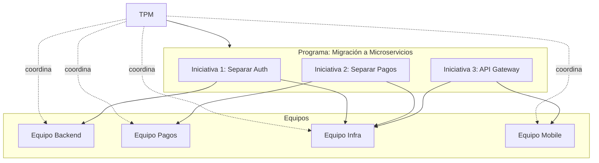
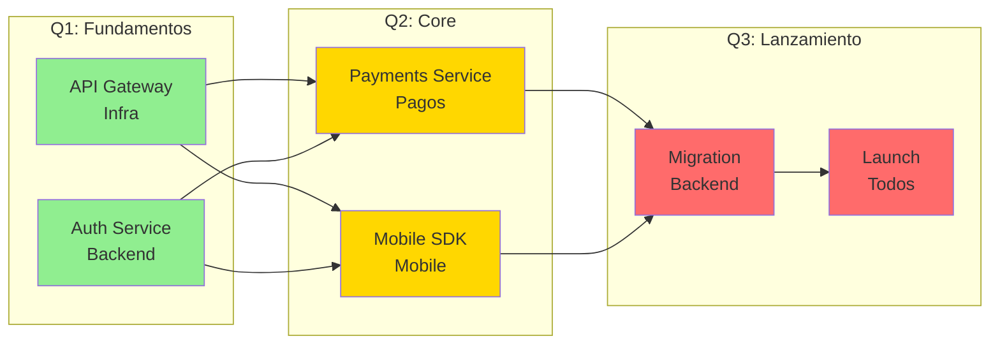
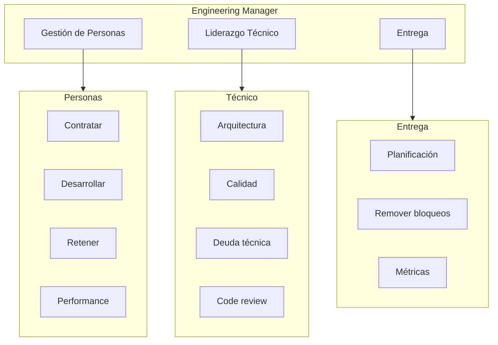
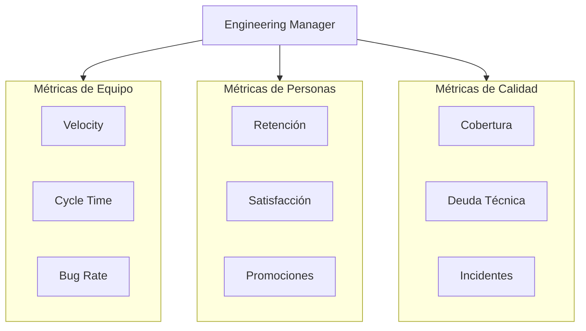
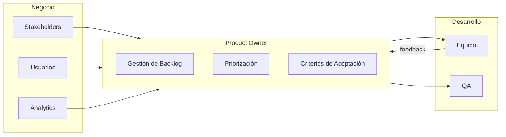

# Roles de Gestión y Coordinación: TPM, Engineering Manager, Product Owner

> Este documento explora los roles que coordinan personas, entregas y valor: Technical Program Manager (TPM), Engineering Manager (EM), y Product Owner (PO). Aunque no escriben código, son esenciales para que el software llegue a los usuarios.

---

## Technical Program Manager (TPM)

### Definición

El TPM es responsable de **coordinar proyectos técnicos complejos que involucran múltiples equipos**. No gestiona personas (eso es el Engineering Manager), sino programas: iniciativas que cruzan boundaries organizacionales.



### Diferencia entre PM, TPM y PO

| Rol                 | Foco                  | Pregunta principal                        | Reporte típico  |
| ------------------- | --------------------- | ----------------------------------------- | --------------- |
| **Product Manager** | Qué construir         | "¿Esto resuelve el problema del usuario?" | CEO/CPO         |
| **TPM**             | Cómo entregar         | "¿Vamos a llegar a la fecha?"             | VP Engineering  |
| **Project Manager** | Tareas y timeline     | "¿Qué falta por hacer?"                   | PM o TPM        |
| **Product Owner**   | Backlog y prioridades | "¿Qué es más importante ahora?"           | Product Manager |

### Responsabilidades Concretas

| Área               | Responsabilidad                       | Entregable               |
| ------------------ | ------------------------------------- | ------------------------ |
| **Planificación**  | Crear roadmaps técnicos               | Timeline con milestones  |
| **Dependencias**   | Identificar y gestionar bloqueos      | Dependency map           |
| **Riesgos**        | Identificar y mitigar riesgos         | Risk register            |
| **Comunicación**   | Status updates a stakeholders         | Weekly reports           |
| **Escalación**     | Escalar problemas cuando es necesario | Decisiones desbloqueadas |
| **Retrospectivas** | Facilitar mejora continua             | Action items             |

### Un Día Típico del TPM

```
08:30  Revisar dashboards de progreso de todos los equipos
09:00  Stand-up con Equipo Backend — escuchar bloqueos
09:30  Stand-up con Equipo Infra — coordinar dependencia con Backend
10:00  1:1 con Tech Lead de Pagos — discutir riesgo de integración
11:00  Preparar status report semanal
12:00  Almuerzo con Engineering Manager — alinear prioridades
13:00  Reunión de planificación Q2 con stakeholders
14:30  Actualizar risk register con nuevo riesgo identificado
15:00  Facilitarsolución de dependencia entre Mobile e Infra
16:00  Review de propuesta técnica con arquitecto
17:00  Enviar status report y preparar agenda de mañana
```

### Herramientas del TPM

| Categoría          | Herramientas               | Propósito             |
| ------------------ | -------------------------- | --------------------- |
| **Tracking**       | Jira, Asana, Linear        | Seguimiento de tareas |
| **Roadmaps**       | Productboard, Notion, Miro | Visualizar plan       |
| **Comunicación**   | Slack, Email, Confluence   | Coordinar equipos     |
| **Presentaciones** | Google Slides, Keynote     | Status a ejecutivos   |
| **Análisis**       | Excel, Google Sheets       | Datos y proyecciones  |
| **Diagramas**      | Miro, Lucidchart           | Dependency maps       |

### Ejemplo: Dependency Map



**Lectura del mapa:**

- 🟢 Verde: En progreso o completado
- 🟡 Amarillo: Próximo, dependencias cumplidas
- 🔴 Rojo: Bloqueado o futuro

### Ejemplo: Risk Register

```markdown
## Risk Register — Proyecto Migración Microservicios

| ID  | Riesgo                               | Probabilidad | Impacto | Mitigación                                      | Owner           | Estado          |
| --- | ------------------------------------ | ------------ | ------- | ----------------------------------------------- | --------------- | --------------- |
| R1  | Tech Lead de Backend renuncia        | Media        | Alto    | Documentar decisiones, pair programming         | EM Backend      | 🟡 Monitoreando |
| R2  | API de pagos externa cambia          | Baja         | Alto    | Wrapper con abstracción, monitorear changelog   | Tech Lead Pagos | 🟢 Mitigado     |
| R3  | Kubernetes no escala como esperamos  | Media        | Medio   | POC de carga antes de migración                 | SRE             | 🟡 En POC       |
| R4  | Mobile no llega a la fecha           | Alta         | Medio   | Reducir scope MVP, priorizar features críticas  | TPM             | 🔴 Activo       |
| R5  | Integraciones legacy no documentadas | Alta         | Alto    | Sesiones de knowledge transfer con equipo viejo | TPM             | 🟡 En progreso  |
```

### Cómo Mide Éxito el TPM

```
┌─────────────────────────────────────────────────────────────────────┐
│  MÉTRICAS DE PROGRAMA — Q1 2024                                     │
│                                                                     │
│  Entregas                                                           │
│  ├── Milestones cumplidos: 4/5 (80%)                               │
│  ├── Milestones on-time: 3/5 (60%)                                 │
│  └── Scope changes: 2 (aprobados)                                  │
│                                                                     │
│  Dependencias                                                       │
│  ├── Identificadas: 15                                             │
│  ├── Resueltas: 12                                                 │
│  ├── Bloqueadas: 2                                                 │
│  └── En riesgo: 1                                                  │
│                                                                     │
│  Comunicación                                                       │
│  ├── Status reports enviados: 12/12 semanas                        │
│  ├── Escalaciones: 3                                               │
│  └── Decisiones desbloqueadas: 8                                   │
│                                                                     │
│  Satisfacción de stakeholders: 4.2/5                               │
└─────────────────────────────────────────────────────────────────────┘
```

---

## Engineering Manager (EM)

### Definición

El Engineering Manager es responsable de **las personas del equipo de ingeniería y la calidad técnica del trabajo**. Combina gestión de personas con liderazgo técnico.



### El Balance de un EM

```
┌─────────────────────────────────────────────────────────────────────┐
│  ¿CUÁNTO CÓDIGO ESCRIBE UN EM?                                      │
│                                                                     │
│  Tamaño del equipo    % Tiempo en código    % Tiempo en gestión    │
│  ─────────────────    ──────────────────    ────────────────────    │
│       2-3                   50%                    50%              │
│       4-6                   30%                    70%              │
│       7-10                  10%                    90%              │
│       10+                    0%                   100%              │
│                                                                     │
│  A medida que el equipo crece, el EM escribe menos código          │
│  pero su impacto técnico es a través de decisiones y mentoring     │
└─────────────────────────────────────────────────────────────────────┘
```

### Responsabilidades Concretas

| Área              | Responsabilidad                  | Entregable          |
| ----------------- | -------------------------------- | ------------------- |
| **Hiring**        | Reclutar y entrevistar           | Equipo completo     |
| **1:1s**          | Reuniones individuales semanales | Feedback continuo   |
| **Performance**   | Evaluar y dar feedback           | Reviews semestrales |
| **Crecimiento**   | Career development               | Promociones, planes |
| **Arquitectura**  | Decisiones técnicas              | ADRs, guías         |
| **Calidad**       | Estándares de código             | Linters, guidelines |
| **Planificación** | Sprint planning                  | Sprints bien scoped |
| **Bloqueos**      | Remover impedimentos             | Equipo productivo   |

### Un Día Típico del EM

```
09:00  1:1 con developer junior — coaching sobre PR complejo
09:30  1:1 con developer senior — discutir path a Staff Engineer
10:00  Stand-up del equipo — escuchar, no dirigir
10:15  Revisar PRs pendientes — aprobar o dejar comentarios
11:00  Reunión con TPM — alinear capacidad del equipo
12:00  Almuerzo
13:00  Entrevista técnica — candidato para backend
14:00  Debrief de entrevista con hiring committee
14:30  Trabajar en ADR para nueva arquitectura de cache
15:30  Reunión con Product Owner — negociar scope del sprint
16:00  1:1 con QA Lead — revisar métricas de calidad
16:30  Preparar agenda de retrospectiva
17:00  Revisar OKRs del equipo y actualizar progreso
```

### Herramientas del EM

| Categoría         | Herramientas            | Propósito                  |
| ----------------- | ----------------------- | -------------------------- |
| **1:1s**          | Notion, Lattice, 15Five | Tracking de conversaciones |
| **Performance**   | Lattice, Culture Amp    | Reviews y feedback         |
| **Hiring**        | Lever, Greenhouse       | Pipeline de candidatos     |
| **Métricas**      | Jellyfish, LinearB      | Engineering metrics        |
| **Documentación** | Confluence, Notion      | ADRs, guías                |
| **Código**        | GitHub, GitLab          | Code review                |

### Ejemplo: Template de 1:1

```markdown
## 1:1 con [Nombre] — [Fecha]

### Check-in (5 min)

- ¿Cómo estás? ¿Algo personal que quieras compartir?
- Energía del 1-10: \_\_\_

### Desde el último 1:1 (10 min)

- ¿Qué fue bien?
- ¿Qué fue difícil?
- ¿Qué aprendiste?

### Bloqueos actuales (10 min)

- ¿Hay algo que te está frenando?
- ¿Necesitas algo de mí?

### Crecimiento (10 min)

- ¿Cómo va el objetivo de [skill específico]?
- ¿Hay oportunidades que te interesen?

### Feedback (5 min)

- Feedback para ti: \_\_\_
- ¿Feedback para mí?

### Action items

- [ ] [Acción] — Owner: **_ — Fecha: _**
```

### Ejemplo: ADR (Architecture Decision Record)

```markdown
# ADR-007: Usar Redis para Cache de Sesiones

## Estado

Aceptado

## Contexto

Actualmente las sesiones se almacenan en PostgreSQL. Con el crecimiento de usuarios (10x en 6 meses), las queries de sesión están impactando el rendimiento de la DB principal.

## Decisión

Migrar el almacenamiento de sesiones de PostgreSQL a Redis.

## Consecuencias

### Positivas

- Latencia de lectura de sesiones: 50ms → 1ms
- Reduce carga en PostgreSQL ~30%
- Redis soporta TTL nativo (expiración automática)

### Negativas

- Nueva pieza de infraestructura para mantener
- Requiere plan de migración para sesiones existentes
- Redis es single-threaded, necesita monitoreo de CPU

### Riesgos

- Si Redis cae, los usuarios pierden sesión (aceptable: re-login)
- Mitigación: Redis Sentinel para alta disponibilidad

## Alternativas Consideradas

### Memcached

- Pros: Más simple, multi-threaded
- Contras: No persiste datos, no soporta estructuras complejas
- Decisión: Redis es mejor fit por TTL y persistencia opcional

### DynamoDB

- Pros: Serverless, alta disponibilidad automática
- Contras: Vendor lock-in, costo variable
- Decisión: Preferimos self-hosted por costo predecible

## Plan de Implementación

1. Sprint 12: Setup Redis en staging
2. Sprint 13: Migrar código de sesiones
3. Sprint 14: Migration script para sesiones existentes
4. Sprint 15: Rollout gradual a producción
```

### Métricas del EM



---

## Product Owner (PO)

### Definición

El Product Owner es responsable de **maximizar el valor del producto** gestionando el backlog y definiendo qué se construye. Es el puente entre el negocio y el equipo de desarrollo.



### PO vs PM vs TPM

```
┌─────────────────────────────────────────────────────────────────────┐
│  FOCO DE CADA ROL                                                   │
│                                                                     │
│  Product Manager     "¿Estamos construyendo el producto correcto?"  │
│        ↓                                                            │
│  Product Owner       "¿Qué features construimos primero?"           │
│        ↓                                                            │
│  TPM                 "¿Cómo entregamos esto a tiempo?"              │
│        ↓                                                            │
│  Engineering Manager "¿Tenemos el equipo para hacerlo bien?"        │
└─────────────────────────────────────────────────────────────────────┘
```

### Responsabilidades Concretas

| Área             | Responsabilidad                   | Entregable              |
| ---------------- | --------------------------------- | ----------------------- |
| **Visión**       | Comunicar el "por qué" al equipo  | Product vision document |
| **Backlog**      | Crear y mantener el backlog       | Historias de usuario    |
| **Priorización** | Decidir qué se hace primero       | Backlog ordenado        |
| **Criterios**    | Definir "done" para cada historia | Acceptance criteria     |
| **Aceptación**   | Validar que las features cumplen  | Sign-off                |
| **Stakeholders** | Gestionar expectativas            | Comunicación regular    |

### Un Día Típico del PO

```
09:00  Revisar analytics del día anterior — buscar insights
09:30  Refinar historias para próximo sprint con Tech Lead
10:30  Stand-up — escuchar progreso, responder preguntas
10:45  Responder preguntas de developers sobre criterios
11:30  Reunión con stakeholder de ventas — nueva feature request
12:00  Almuerzo
13:00  Escribir historias de usuario para feature nueva
14:00  Demo con usuario beta — validar prototipo
15:00  Priorizar backlog — reordenar según feedback
16:00  Preparar sprint review — qué mostrar a stakeholders
17:00  Revisar métricas de features lanzadas recientemente
```

### Herramientas del PO

| Categoría         | Herramientas         | Propósito                  |
| ----------------- | -------------------- | -------------------------- |
| **Backlog**       | Jira, Linear, Trello | Gestionar historias        |
| **Roadmap**       | Productboard, Aha!   | Comunicar visión           |
| **Prototipos**    | Figma, Sketch        | Validar antes de construir |
| **Analytics**     | Amplitude, Mixpanel  | Medir uso real             |
| **Feedback**      | Intercom, Hotjar     | Escuchar usuarios          |
| **Documentación** | Notion, Confluence   | Specs y criterios          |

### Ejemplo: Historia de Usuario

````markdown
## Historia: Login con Google

### Formato

**Como** usuario nuevo
**Quiero** poder registrarme usando mi cuenta de Google
**Para** no tener que crear otra contraseña

### Criterios de Aceptación

#### Escenario: Registro exitoso con Google

```gherkin
Given estoy en la página de registro
When hago clic en "Continuar con Google"
And selecciono mi cuenta de Google
And autorizo el acceso
Then soy redirigido al dashboard
And veo un mensaje de bienvenida
And mi perfil tiene mi nombre y foto de Google
```
````

#### Escenario: Usuario ya existe con email

```gherkin
Given existe un usuario con email "user@gmail.com"
When intento registrarme con Google usando ese email
Then veo un mensaje "Ya tienes una cuenta. Inicia sesión."
And tengo opción de vincular la cuenta de Google
```

#### Escenario: Usuario cancela autorización

```gherkin
Given estoy en la página de autorización de Google
When hago clic en "Cancelar"
Then vuelvo a la página de registro
And veo un mensaje "Registro cancelado"
```

### Notas Técnicas

- Usar OAuth 2.0 con PKCE
- Scopes necesarios: email, profile
- Almacenar Google ID para futuros logins

### Métricas de Éxito

- 30% de nuevos registros usan Google (vs email)
- Reducción de tickets de "olvidé mi contraseña" en 20%

### Prioridad

Must-have para launch

### Story Points

5

````

### Priorización: Frameworks

```mermaid
flowchart TB
    subgraph RICE["RICE Score"]
        R[Reach<br/>¿A cuántos usuarios afecta?]
        I[Impact<br/>¿Cuánto mejora su vida?]
        C[Confidence<br/>¿Qué tan seguros estamos?]
        E[Effort<br/>¿Cuánto trabajo es?]

        FORMULA["Score = (R × I × C) / E"]
    end

    subgraph MOSCOW["MoSCoW"]
        MUST[Must Have<br/>Sin esto no lanzamos]
        SHOULD[Should Have<br/>Importante pero no crítico]
        COULD[Could Have<br/>Nice to have]
        WONT[Won't Have<br/>Fuera de scope]
    end
````

### Ejemplo: Backlog Priorizado

```
┌─────────────────────────────────────────────────────────────────────┐
│  BACKLOG — Sprint 15                                                │
│                                                                     │
│  Prioridad   Historia                    Puntos   RICE   Estado     │
│  ─────────   ────────                    ──────   ────   ──────     │
│  1 (Must)    Login con Google            5       850    🔵 Ready   │
│  2 (Must)    Reset password              3       720    🔵 Ready   │
│  3 (Should)  Notificaciones push         8       680    🔵 Ready   │
│  4 (Should)  Filtros avanzados           5       520    🟡 Refining│
│  5 (Could)   Dark mode                   3       340    ⚪ Backlog │
│  6 (Could)   Exportar a CSV              2       280    ⚪ Backlog │
│                                                                     │
│  Capacidad del sprint: 16 puntos                                   │
│  Comprometido: 16 puntos (historias 1-3)                           │
└─────────────────────────────────────────────────────────────────────┘
```

### Métricas del PO

```
┌─────────────────────────────────────────────────────────────────────┐
│  MÉTRICAS DE PRODUCTO — Marzo 2024                                  │
│                                                                     │
│  Adopción                                                           │
│  ├── Usuarios activos: 12,500 (+15% vs mes anterior)               │
│  ├── Nuevos registros: 2,100                                       │
│  └── Churn: 3.2% (-0.5%)                                           │
│                                                                     │
│  Engagement                                                         │
│  ├── Sessions/user: 4.2                                            │
│  ├── Time on site: 8min avg                                        │
│  └── Feature adoption (nueva feature): 45%                         │
│                                                                     │
│  Satisfacción                                                       │
│  ├── NPS: 42 (+5)                                                  │
│  ├── Support tickets: 89 (-20%)                                    │
│  └── App Store rating: 4.6                                         │
│                                                                     │
│  Entrega                                                           │
│  ├── Historias entregadas: 18/20 (90%)                             │
│  ├── Bugs en producción: 3                                         │
│  └── Lead time promedio: 5 días                                    │
└─────────────────────────────────────────────────────────────────────┘
```

---

## Interacción entre los Tres Roles

```mermaid
sequenceDiagram
    participant PO as Product Owner
    participant EM as Eng Manager
    participant TPM as TPM
    participant TEAM as Equipo

    Note over PO,TEAM: Planificación Trimestral

    PO->>TPM: Prioridades de producto para Q2
    TPM->>EM: ¿Capacidad del equipo?
    EM->>TPM: 2 devs, 1 QA, capacidad ~40 puntos/sprint
    TPM->>PO: Podemos hacer Features A, B, C. D queda fuera.
    PO->>TPM: OK, ajustamos scope

    Note over PO,TEAM: Durante el Sprint

    TEAM->>PO: ¿Qué pasa si el usuario hace X?
    PO->>TEAM: Comportamiento esperado es Y

    TEAM->>EM: Bloqueado por dependencia externa
    EM->>TPM: Necesitamos escalar
    TPM->>TPM: Coordina con otro equipo
    TPM->>EM: Resuelto, pueden continuar

    Note over PO,TEAM: Sprint Review

    TEAM->>PO: Demo de Feature A
    PO->>TEAM: Aprobado ✓
    PO->>TPM: Feature A lista para release
    TPM->>EM: ¿Release esta semana?
    EM->>TPM: Sí, error budget disponible
```



### Decisiones por Rol

| Decisión                       | Quién decide   | Quién consulta   |
| ------------------------------ | -------------- | ---------------- |
| "¿Qué feature construimos?"    | PO             | PM, Stakeholders |
| "¿Cuándo estará listo?"        | TPM            | EM, PO           |
| "¿Quién lo construye?"         | EM             | Tech Lead        |
| "¿Cómo lo construimos?"        | EM + Tech Lead | Equipo           |
| "¿Cumple los criterios?"       | PO             | QA               |
| "¿Está listo para producción?" | EM + QA        | Release Manager  |

---

## Referencia Rápida

### Comparación de Roles de Gestión

| Aspecto                | TPM                   | EM                        | PO               |
| ---------------------- | --------------------- | ------------------------- | ---------------- |
| **Foco**               | Programa/entregas     | Equipo/personas           | Producto/valor   |
| **Gestiona**           | Proyectos             | Personas                  | Backlog          |
| **Pregunta clave**     | ¿Llegaremos a tiempo? | ¿El equipo puede hacerlo? | ¿Esto da valor?  |
| **Métrica**            | On-time delivery      | Team health               | User adoption    |
| **Herramienta típica** | Jira, Asana           | 1:1s, Lattice             | Productboard     |
| **Background común**   | PM, Ex-engineer       | Senior engineer           | PM, UX, Business |

### Cuándo Escalar a Cada Rol

| Situación                               | Escalar a |
| --------------------------------------- | --------- |
| "No sé qué priorizar"                   | PO        |
| "No tenemos capacidad"                  | EM        |
| "Dependemos de otro equipo"             | TPM       |
| "El equipo está desmotivado"            | EM        |
| "El stakeholder cambió el scope"        | TPM + PO  |
| "No entiendo el criterio de aceptación" | PO        |

### Anti-patrones Comunes

| Rol     | Anti-patrón                             | Consecuencia          |
| ------- | --------------------------------------- | --------------------- |
| **TPM** | Micromanagear tareas                    | Equipo dependiente    |
| **TPM** | No escalar riesgos                      | Sorpresas en deadline |
| **EM**  | Solo gestionar, no liderar técnicamente | Deuda técnica crece   |
| **EM**  | Ignorar 1:1s                            | Retención cae         |
| **PO**  | Cambiar prioridades constantemente      | Equipo frustrado      |
| **PO**  | No decir "no" a stakeholders            | Backlog infinito      |
