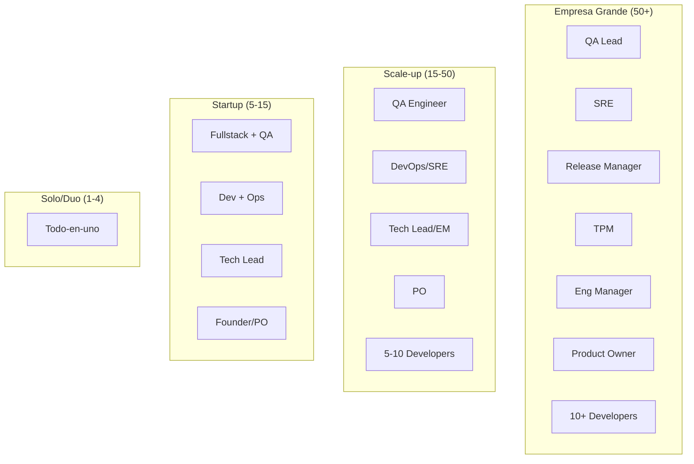
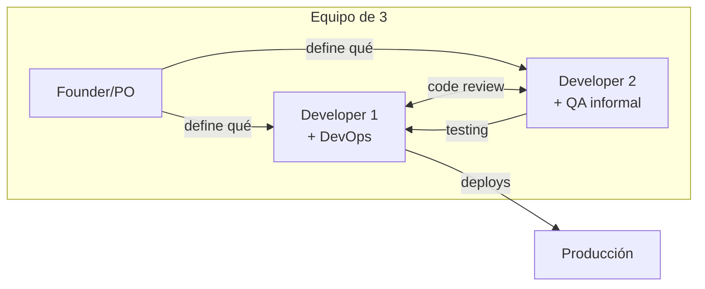
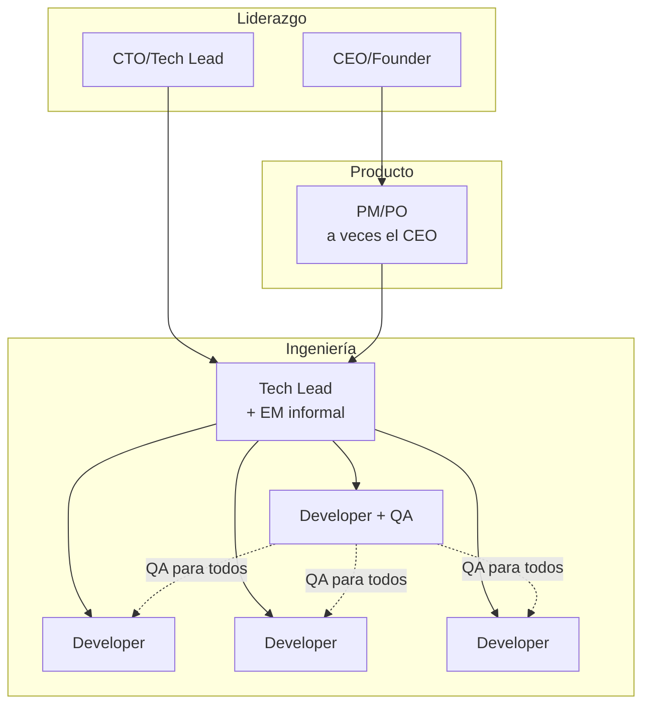
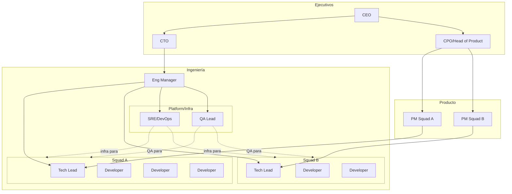

# Consolidación de Roles en Equipos Pequeños

> Este documento explora cómo adaptar los roles de verificación cuando no hay presupuesto o necesidad de roles dedicados. Desde el solo founder hasta equipos de 15 personas, cada etapa tiene su configuración óptima.

---

## La Realidad de los Equipos Pequeños

En startups y equipos pequeños, los roles formales no existen como posiciones separadas. En su lugar, las **responsabilidades** se distribuyen entre las personas disponibles.



---

## Etapa 1: Solo Founder / Freelancer (1 persona)

### Configuración

```
┌─────────────────────────────────────────────────────────────────────┐
│  UNA PERSONA = TODOS LOS ROLES                                      │
│                                                                     │
│  👤 Tú                                                              │
│  ├── Developer (escribir código)                                    │
│  ├── QA (probar código)                                             │
│  ├── DevOps (deployar)                                              │
│  ├── SRE (monitorear)                                               │
│  ├── PO (decidir qué construir)                                     │
│  ├── TPM (planificar)                                               │
│  └── Soporte (responder usuarios)                                   │
│                                                                     │
│  ⚠️ Riesgo: Burnout, puntos ciegos, sesgo del creador               │
└─────────────────────────────────────────────────────────────────────┘
```

### Estrategias de Supervivencia

#### 1. Automatizar lo que puedas

```yaml
# .github/workflows/ci.yml — CI básico pero efectivo
name: CI
on: [push, pull_request]

jobs:
  test:
    runs-on: ubuntu-latest
    steps:
      - uses: actions/checkout@v4
      - uses: actions/setup-node@v4
        with:
          node-version: '20'
      - run: npm ci
      - run: npm test
      - run: npm run lint
      - run: npm run build

  deploy:
    needs: test
    if: github.ref == 'refs/heads/main'
    runs-on: ubuntu-latest
    steps:
      - uses: actions/checkout@v4
      - run: npm ci && npm run build
      - run: npx vercel --prod --token=${{ secrets.VERCEL_TOKEN }}
```

#### 2. Usar herramientas que actúen como "roles"

| Rol ausente         | Herramienta que lo reemplaza            |
| ------------------- | --------------------------------------- |
| **QA**              | Tests automatizados + Sentry            |
| **SRE**             | Vercel/Railway (managed) + Uptime Robot |
| **Release Manager** | GitHub Actions + Auto-deploy            |
| **Monitoreo**       | Sentry + LogTail                        |

#### 3. Checklist antes de deploy (tu QA interno)

```markdown
## Pre-deploy Checklist (solo founder)

### Antes de merge a main

- [ ] ¿Escribí al menos un test para el cambio?
- [ ] ¿Probé manualmente los casos edge?
- [ ] ¿Revisé el código como si fuera de otra persona?
- [ ] ¿El build pasa en CI?

### Después de deploy

- [ ] ¿El smoke test pasa? (hit al endpoint principal)
- [ ] ¿Sentry muestra errores nuevos?
- [ ] ¿Los logs tienen algo raro?

### Si algo sale mal

- [ ] ¿Sé cómo hacer rollback? (git revert + re-deploy)
```

#### 4. IA como "segundo par de ojos"

```
Prompt para review de código:

"Actúa como un QA senior. Revisa este código buscando:
1. Casos edge no manejados
2. Errores de seguridad (SQL injection, XSS)
3. Errores de lógica
4. Tests que faltan

[pegar código]"
```

---

## Etapa 2: Duo/Trío (2-4 personas)

### Configuración Típica



### División de Responsabilidades

| Responsabilidad        | Quién la toma                | Tiempo dedicado      |
| ---------------------- | ---------------------------- | -------------------- |
| Decisiones de producto | Founder                      | 100% de su tiempo    |
| Code reviews           | Developers (cruzado)         | 10% del tiempo       |
| Testing manual         | El que NO escribió el código | 5% del tiempo        |
| CI/CD setup            | Developer más senior         | 5% del tiempo        |
| Monitoreo              | Rotativo                     | 2% del tiempo        |
| On-call                | Todos (pero simple)          | Cuando hay incidente |

### Regla de Oro: Cross-Review

```
❌ Malo:
Developer 1 escribe Feature A → Developer 1 la prueba → Deploy

✅ Bueno:
Developer 1 escribe Feature A → Developer 2 la revisa y prueba → Deploy
```

El valor no es solo encontrar bugs, sino que **otra persona entienda el código** (bus factor = 2).

### Herramientas para Equipos Pequeños

| Necesidad     | Herramienta gratuita/barata          | Por qué                |
| ------------- | ------------------------------------ | ---------------------- |
| **Tracking**  | GitHub Issues / Linear Free          | Integrado con código   |
| **CI/CD**     | GitHub Actions (2000 min/mes gratis) | Sin setup              |
| **Hosting**   | Vercel / Railway / Render            | Deploy automático      |
| **Monitoreo** | Sentry Free (5k eventos/mes)         | Errores en tiempo real |
| **Uptime**    | UptimeRobot Free (50 monitors)       | Alertas básicas        |
| **Logs**      | LogTail Free (1GB/mes)               | Debugging              |
| **DB**        | Supabase / PlanetScale Free          | Managed, backups       |

---

## Etapa 3: Startup Temprana (5-10 personas)

### Configuración Típica



### Cuándo Agregar el Primer QA Dedicado

**Señales de que lo necesitas:**

```
□ Los developers pasan >20% del tiempo haciendo testing manual
□ Los mismos bugs aparecen en producción repetidamente
□ Los usuarios encuentran bugs que deberían ser obvios
□ No hay tiempo para escribir tests automatizados
□ El Tech Lead está haciendo QA en lugar de liderar
□ Los deploys se retrasan por falta de testing
```

**Perfil del primer QA:**

```
┌─────────────────────────────────────────────────────────────────────┐
│  PRIMER QA — Perfil Ideal                                           │
│                                                                     │
│  ✅ Buscar:                                                         │
│  ├── Experiencia en automatización (no solo manual)                 │
│  ├── Puede escribir tests en el stack del equipo                    │
│  ├── Mentalidad de "prevenir" más que "encontrar"                   │
│  ├── Comunicación clara con developers                              │
│  └── Comodidad trabajando sin procesos formales                     │
│                                                                     │
│  ❌ Evitar:                                                          │
│  ├── Solo testing manual / click-testing                            │
│  ├── Necesita procesos muy estructurados                            │
│  ├── Ve a developers como "el enemigo"                              │
│  └── Solo experiencia en empresas grandes                           │
└─────────────────────────────────────────────────────────────────────┘
```

### Roles Híbridos Comunes

| Título                  | Responsabilidades reales              |
| ----------------------- | ------------------------------------- |
| **Tech Lead**           | EM + Arquitectura + 50% código        |
| **Fullstack Developer** | Frontend + Backend + a veces DevOps   |
| **DevOps Engineer**     | SRE + Release Manager + Infra         |
| **QA Engineer**         | QA Lead + Automation + Manual testing |
| **Product Manager**     | PO + UX + a veces soporte             |

---

## Etapa 4: Scale-up (10-20 personas)

### Configuración Típica



### Transición de Roles

| De                    | A            | Cuándo                                  |
| --------------------- | ------------ | --------------------------------------- |
| Tech Lead hace EM     | EM dedicado  | Cuando TL no puede codear por reuniones |
| Developer hace DevOps | SRE dedicado | Cuando infra requiere >20h/semana       |
| Developers hacen QA   | QA dedicado  | Cuando bugs en prod son frecuentes      |
| CEO hace PM           | PM dedicado  | Cuando CEO no puede hacer producto      |
| PM hace PO            | PO dedicado  | Cuando hay múltiples squads             |

### El Problema del "Primer Manager"

```
┌─────────────────────────────────────────────────────────────────────┐
│  TRANSICIÓN: Tech Lead → Engineering Manager                        │
│                                                                     │
│  Antes (5 personas):                                                │
│  └── Tech Lead escribe código, hace reviews, toma decisiones        │
│                                                                     │
│  Después (10 personas):                                             │
│  └── EM hace 1:1s, hiring, planning, performance reviews            │
│  └── Ya no escribe código (o muy poco)                              │
│                                                                     │
│  ⚠️ Trampa común:                                                   │
│  El mejor developer se vuelve manager y:                            │
│  - Pierde lo que lo hacía valioso (código)                          │
│  - Gana algo que no sabe hacer (gestión de personas)                │
│                                                                     │
│  ✅ Solución:                                                        │
│  - No todos los Tech Leads deben ser EMs                            │
│  - Crear track de IC (Individual Contributor) → Staff Engineer      │
│  - Contratar EM con experiencia si es posible                       │
└─────────────────────────────────────────────────────────────────────┘
```

---

## Matriz de Responsabilidades por Tamaño

```
┌─────────────────────────────────────────────────────────────────────────────┐
│                           TAMAÑO DEL EQUIPO                                  │
│  Responsabilidad      │ 1    │ 2-4   │ 5-10  │ 10-20  │ 20+               │
├───────────────────────┼──────┼───────┼───────┼────────┼───────────────────┤
│ Escribir código       │ Tú   │ Devs  │ Devs  │ Devs   │ Devs              │
│ Code review           │ IA   │ Cross │ Cross │ Cross  │ Cross + TL        │
│ Testing manual        │ Tú   │ Cross │ QA    │ QA     │ QA Team           │
│ Tests automatizados   │ Tú   │ Devs  │ Devs  │ QA+Dev │ QA + SDET         │
│ CI/CD                 │ Auto │ 1 Dev │ DevOps│ SRE    │ Platform Team     │
│ Monitoreo             │ Saas │ 1 Dev │ DevOps│ SRE    │ SRE Team          │
│ On-call               │ Tú   │ Todos │ Rota  │ Rota   │ SRE + Devs        │
│ Decisiones producto   │ Tú   │ Found │ PM    │ PM+PO  │ PM + PO + UX      │
│ Arquitectura          │ Tú   │ Todos │ TL    │ TL+EM  │ Staff + Architects│
│ Hiring                │ Tú   │ Found │ Found │ EM     │ EM + Recruiting   │
│ 1:1s / Performance    │ N/A  │ N/A   │ TL    │ EM     │ EM + Skip levels  │
│ Planificación sprints │ Tú   │ Found │ TL+PM │ EM+PM  │ TPM + EM + PM     │
│ Comunicación externa  │ Tú   │ Found │ PM    │ PM     │ PM + Marketing    │
└───────────────────────┴──────┴───────┴───────┴────────┴───────────────────┘

Leyenda:
- Tú = Solo founder
- Found = Founder
- Cross = Cross-review entre developers
- Auto = Herramientas automáticas (Vercel, GitHub Actions)
- Rota = Rotación entre el equipo
- IA = Usar IA como reviewer
```

---

## Señales de que Necesitas un Rol Dedicado

### Necesitas un QA cuando:

```typescript
const necesitasQA = (equipo: Equipo): boolean => {
  const señales = [
    equipo.bugsEnProduccionPorMes > 5,
    equipo.tiempoEnTestingManual > 0.2, // >20% del tiempo
    equipo.mismosBugsRepetidos > 2,
    equipo.usuariosReportanBugsObvios,
    equipo.noHayTiempoParaAutomatizar,
    equipo.deploysRetrasadosPorTesting,
  ];

  return señales.filter(Boolean).length >= 3;
};
```

### Necesitas un SRE/DevOps cuando:

```typescript
const necesitasSRE = (equipo: Equipo): boolean => {
  const señales = [
    equipo.incidentesPorMes > 2,
    equipo.tiempoEnInfra > 0.3, // >30% de un dev
    equipo.deploysManualesTomanMasDe30Min,
    equipo.noHayMonitoreoReal,
    equipo.desarrolladoresDespiertanDeNoche,
    equipo.escalarInfraEsProblema,
  ];

  return señales.filter(Boolean).length >= 3;
};
```

### Necesitas un EM cuando:

```typescript
const necesitasEM = (equipo: Equipo): boolean => {
  const señales = [
    equipo.tamaño > 6,
    equipo.techLeadNoPuedeCodear, // por reuniones
    equipo.noHay1on1sRegulares,
    equipo.hiringEsCaótico,
    equipo.genteSeVaSinSaberPorQué,
    equipo.conflictosNoResueltos,
  ];

  return señales.filter(Boolean).length >= 3;
};
```

### Necesitas un TPM cuando:

```typescript
const necesitasTPM = (equipo: Equipo): boolean => {
  const señales = [
    equipo.proyectosCruzanMultiplesEquipos,
    equipo.deadlinesFalladosFrecuentemente,
    equipo.stakeholdersConfundidos,
    equipo.dependenciasNoGestionadas,
    equipo.nadieTrackProgreso,
    equipo.reunionesIneficientes,
  ];

  return señales.filter(Boolean).length >= 3;
};
```

---

## Cómo Introducir Procesos sin Burocracia

### Principio: Mínimo Proceso Viable

```
┌─────────────────────────────────────────────────────────────────────┐
│  PROCESO vs BUROCRACIA                                              │
│                                                                     │
│  ✅ Proceso útil:                                                   │
│  - Resuelve un problema real que el equipo tiene                    │
│  - Es el mínimo necesario para resolverlo                           │
│  - El equipo lo adopta voluntariamente                              │
│  - Se puede modificar cuando deja de servir                         │
│                                                                     │
│  ❌ Burocracia:                                                      │
│  - Se implementa "porque así se hace en empresas serias"            │
│  - Requiere más tiempo del que ahorra                               │
│  - Nadie sabe por qué existe                                        │
│  - Es difícil de cambiar                                            │
└─────────────────────────────────────────────────────────────────────┘
```

### Ejemplo: Introducir Code Reviews

**Semana 1: Experimento**

```markdown
"Hey equipo, la próxima semana probemos hacer code review antes de merge.
Regla simple: otro dev debe aprobar el PR antes de mergear.
Veamos si ayuda a reducir bugs."
```

**Semana 2: Evaluar**

```markdown
"¿Cómo fue? ¿Encontramos bugs antes? ¿Fue muy lento?"
```

**Semana 3: Ajustar o Adoptar**

```markdown
Si funcionó: "OK, lo hacemos siempre"
Si no: "Probemos solo para cambios críticos"
Si fue malo: "Descartado, volvemos a como antes"
```

### Procesos Mínimos por Etapa

| Etapa              | Procesos recomendados                           |
| ------------------ | ----------------------------------------------- |
| **1 persona**      | CI automático, checklist personal               |
| **2-4 personas**   | + Code reviews, + deploy checklist              |
| **5-10 personas**  | + Sprint planning, + retros, + on-call rotation |
| **10-20 personas** | + 1:1s formales, + incident management, + OKRs  |
| **20+ personas**   | + Performance reviews, + career ladders, + ADRs |

---

## Referencia Rápida

### Configuración por Tamaño

| Tamaño | Config típica                 | Riesgo principal        |
| ------ | ----------------------------- | ----------------------- |
| 1      | Todo-en-uno + IA + SaaS       | Burnout, puntos ciegos  |
| 2-4    | Cross-review + automatización | Bus factor, scope creep |
| 5-10   | Tech Lead + QA parcial        | Tech Lead sobrecargado  |
| 10-20  | EM + QA + SRE básico          | Comunicación, silos     |
| 20+    | Roles dedicados               | Burocracia, lentitud    |

### Cuándo Contratar Cada Rol

| Rol     | Contratar cuando...          | No contratar si...        |
| ------- | ---------------------------- | ------------------------- |
| **QA**  | Bugs frecuentes en prod      | Devs pueden automatizar   |
| **SRE** | Infra consume >30% de un dev | SaaS resuelve el problema |
| **EM**  | TL no puede codear           | Equipo <6 personas        |
| **TPM** | Proyectos cruzan equipos     | Solo hay un equipo        |
| **PO**  | PM no puede estar en sprints | PM puede hacerlo          |

### Automatización como Sustituto

| Rol             | Herramienta que lo sustituye parcialmente |
| --------------- | ----------------------------------------- |
| QA              | Tests automatizados + Sentry              |
| SRE             | Vercel/Railway + UptimeRobot + PagerDuty  |
| Release Manager | GitHub Actions + auto-deploy              |
| TPM             | Linear/Asana + automations                |
