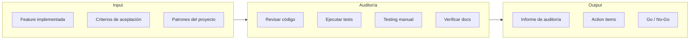
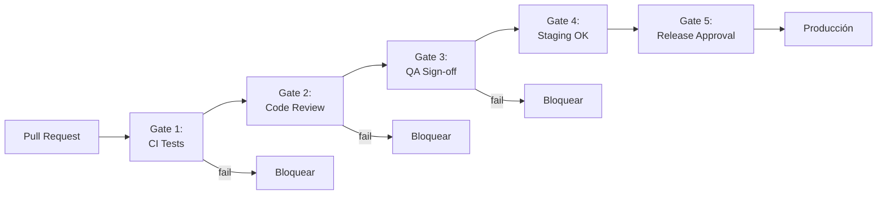
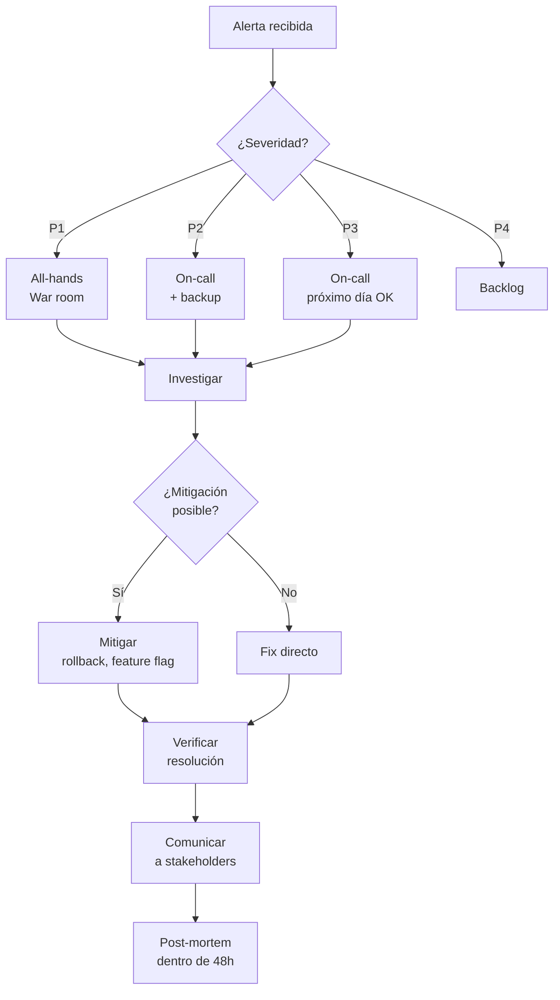

# Procesos de Auditoría y Verificación en la Práctica

> Este documento detalla los procesos concretos de verificación: feature audits, code reviews, release gates, post-mortems e incident management. Incluye templates y ejemplos listos para usar.

---

## Feature Audit (Auditoría de Features)

### Qué Es

Una feature audit es una **revisión sistemática de una funcionalidad implementada** para verificar que cumple con los criterios de aceptación, sigue los patrones del proyecto, tiene tests adecuados, y está lista para producción.



### Cuándo Hacer una Feature Audit

| Situación                            | Nivel de auditoría      |
| ------------------------------------ | ----------------------- |
| Feature pequeña, bajo riesgo         | Code review normal      |
| Feature mediana, riesgo moderado     | Audit ligera (30 min)   |
| Feature grande, alto riesgo          | Audit completa (2-4h)   |
| Feature crítica (pagos, auth, datos) | Audit + security review |
| Post-incidente                       | Audit retrospectiva     |

### Proceso de Feature Audit

#### Paso 1: Preparación

```markdown
## Checklist de Preparación

- [ ] Identificar el issue/PR a auditar
- [ ] Leer los criterios de aceptación originales
- [ ] Identificar archivos modificados
- [ ] Conocer el contexto del cambio
```

#### Paso 2: Auditoría de Código

```markdown
## Checklist de Código

### Estructura

- [ ] ¿Sigue los patrones del proyecto?
- [ ] ¿Está en el lugar correcto del codebase?
- [ ] ¿Los nombres son descriptivos y consistentes?

### Calidad

- [ ] ¿Hay código duplicado que debería abstraerse?
- [ ] ¿Las funciones son pequeñas y hacen una sola cosa?
- [ ] ¿El código es legible sin comentarios excesivos?

### Seguridad

- [ ] ¿Se validan los inputs del usuario?
- [ ] ¿Se sanitizan los datos antes de mostrarlos?
- [ ] ¿Se usan prepared statements para queries?
- [ ] ¿Los secrets están en variables de entorno?

### Performance

- [ ] ¿Hay queries N+1?
- [ ] ¿Se usa paginación donde corresponde?
- [ ] ¿Hay operaciones bloqueantes innecesarias?
```

#### Paso 3: Auditoría de Tests

```bash
# Ejecutar tests del módulo
npm test -- --testPathPattern="[modulo]"

# Verificar cobertura
npm test -- --coverage --collectCoverageFrom="src/[modulo]/**"
```

```markdown
## Checklist de Tests

### Existencia

- [ ] ¿Existen tests unitarios?
- [ ] ¿Existen tests de integración (si aplica)?
- [ ] ¿Existen tests E2E para flujos críticos?

### Calidad

- [ ] ¿Los tests cubren el happy path?
- [ ] ¿Los tests cubren casos de error?
- [ ] ¿Los tests son independientes entre sí?
- [ ] ¿Los tests son determinísticos (no flaky)?

### Cobertura

- [ ] Statements >80%
- [ ] Branches >70%
- [ ] Functions >80%
```

#### Paso 4: Testing Manual

```markdown
## Checklist de Testing Manual

### Funcionalidad

- [ ] ¿El feature funciona como se espera?
- [ ] ¿Cada criterio de aceptación se cumple?

### Edge Cases

- [ ] ¿Qué pasa con inputs vacíos?
- [ ] ¿Qué pasa con inputs muy largos?
- [ ] ¿Qué pasa con caracteres especiales?
- [ ] ¿Qué pasa si el usuario no tiene permisos?

### UX

- [ ] ¿Los mensajes de error son claros?
- [ ] ¿Hay estados de loading?
- [ ] ¿Funciona en mobile?
```

#### Paso 5: Generar Informe

```markdown
# Informe de Feature Audit

## Feature: [Nombre]

**Issue:** #123
**Fecha:** 2024-03-15
**Auditor:** [Nombre]

## Resultado: ✅ APROBADO / ⚠️ CON OBSERVACIONES / ❌ RECHAZADO

## Resumen

[2-3 oraciones sobre el estado general]

## Criterios de Aceptación

| Criterio         | Estado | Notas                  |
| ---------------- | ------ | ---------------------- |
| Usuario puede X  | ✅     | Funciona correctamente |
| Sistema valida Y | ⚠️     | Falta validación de Z  |

## Tests

| Métrica              | Valor | Estado |
| -------------------- | ----- | ------ |
| Tests pasando        | 15/15 | ✅     |
| Cobertura statements | 85%   | ✅     |
| Cobertura branches   | 72%   | ✅     |

## Hallazgos

### 🔴 Bloqueante

[Si hay algo que bloquea el deploy]

### 🟡 Mejora Recomendada

- Agregar validación de email
- Mejorar mensaje de error en caso X

### 🟢 Observaciones Menores

- Typo en comentario línea 45

## Action Items

- [ ] [Acción 1] — Owner: [nombre]
- [ ] [Acción 2] — Owner: [nombre]
```

---

## Code Review (Revisión de Código)

### Filosofía del Code Review

```
┌─────────────────────────────────────────────────────────────────────┐
│  PROPÓSITO DEL CODE REVIEW                                          │
│                                                                     │
│  ✅ SÍ es para:                                                     │
│  ├── Compartir conocimiento del codebase                            │
│  ├── Encontrar bugs antes de que lleguen a producción               │
│  ├── Mantener consistencia en el código                             │
│  ├── Mejorar el diseño a través de discusión                        │
│  └── Asegurar que otro humano entiende el código                    │
│                                                                     │
│  ❌ NO es para:                                                      │
│  ├── Demostrar superioridad técnica                                 │
│  ├── Imponer preferencias personales sin justificación              │
│  ├── Bloquear PRs por razones políticas                             │
│  └── Reescribir el código del otro                                  │
└─────────────────────────────────────────────────────────────────────┘
```

### Tipos de Comentarios

```markdown
## Clasificación de Comentarios en Code Review

### 🔴 Blocker (debe arreglarse)

"Este código tiene una SQL injection.
Hay que usar prepared statements."

### 🟡 Suggestion (debería considerarse)

"Sugiero extraer esta lógica a una función separada
para mejorar la legibilidad. ¿Qué te parece?"

### 🟢 Nit (nitpick, opcional)

"nit: Typo en el nombre de la variable 'recieve' → 'receive'"

### 💭 Question (pregunta, no bloquea)

"¿Por qué elegiste usar recursión aquí en lugar de un loop?"

### 📚 FYI (informativo)

"FYI: Tenemos un helper para esto en utils/dates.ts"
```

### Template de PR Description

```markdown
## Descripción

[Qué hace este PR y por qué]

## Issue

Closes #123

## Tipo de cambio

- [ ] Bug fix
- [ ] Nueva feature
- [ ] Refactoring
- [ ] Documentación
- [ ] CI/CD
- [ ] Otro: \_\_\_

## Checklist

- [ ] El código sigue los patrones del proyecto
- [ ] He agregado tests que cubren los cambios
- [ ] Los tests existentes pasan
- [ ] He actualizado la documentación (si aplica)
- [ ] He probado manualmente los cambios

## Screenshots (si aplica UI)

[Antes / Después]

## Notas para el reviewer

[Cualquier contexto adicional, áreas de preocupación, etc.]
```

### Checklist para Reviewers

```typescript
// reviewer-checklist.ts
interface ReviewChecklist {
  // Correctitud
  logicaCorrecta: boolean;
  manejaCasosEdge: boolean;
  manejaErrores: boolean;

  // Seguridad
  validaInputs: boolean;
  sinSecretsHardcoded: boolean;
  sinVulnerabilidades: boolean;

  // Calidad
  codigoLegible: boolean;
  nombresDescriptivos: boolean;
  sinDuplicacion: boolean;

  // Tests
  tieneTests: boolean;
  testsCubrenCambios: boolean;
  testsSignificativos: boolean;

  // Mantenibilidad
  siguePatrones: boolean;
  documentado: boolean;
  facildEntender: boolean;
}
```

### Ejemplo de Code Review

```typescript
// PR: Add user registration endpoint

// ============================================
// Código original:
// ============================================

async function register(email: string, password: string) {
  const user = await db.query(`
    INSERT INTO users (email, password)
    VALUES ('${email}', '${password}')
  `);
  return user;
}

// ============================================
// Review comments:
// ============================================

// 🔴 BLOCKER @reviewer:
// SQL Injection vulnerability. Never interpolate user input directly.
// Use parameterized queries:
//
// await db.query(
//   'INSERT INTO users (email, password) VALUES ($1, $2)',
//   [email, hashedPassword]
// );

// 🔴 BLOCKER @reviewer:
// Storing plaintext password. Must hash with bcrypt:
//
// import bcrypt from 'bcrypt';
// const hashedPassword = await bcrypt.hash(password, 12);

// 🟡 SUGGESTION @reviewer:
// Consider adding email validation before inserting.
// We have a helper: import { isValidEmail } from '@/utils/validation';

// 🟢 NIT @reviewer:
// Function should be async and named registerUser for clarity.

// ============================================
// Código corregido:
// ============================================

import bcrypt from 'bcrypt';
import { isValidEmail } from '@/utils/validation';

async function registerUser(email: string, password: string) {
  if (!isValidEmail(email)) {
    throw new BadRequestException('Invalid email format');
  }

  const hashedPassword = await bcrypt.hash(password, 12);

  const user = await db.query(
    'INSERT INTO users (email, password) VALUES ($1, $2) RETURNING id, email',
    [email, hashedPassword]
  );

  return user;
}
```

---

## Release Gates

### Qué Son

Release gates son **puntos de control que deben pasarse** antes de que el código llegue a producción. Pueden ser automatizados (CI checks) o manuales (approvals).



### Gates Automatizados (CI)

```yaml
# .github/workflows/release-gates.yml
name: Release Gates

on:
  pull_request:
    branches: [main]
  push:
    branches: [main]

jobs:
  # Gate 1: Tests
  tests:
    runs-on: ubuntu-latest
    steps:
      - uses: actions/checkout@v4
      - run: npm ci
      - run: npm test
      - name: Upload coverage
        uses: codecov/codecov-action@v3

  # Gate 2: Linting
  lint:
    runs-on: ubuntu-latest
    steps:
      - uses: actions/checkout@v4
      - run: npm ci
      - run: npm run lint
      - run: npm run typecheck

  # Gate 3: Security
  security:
    runs-on: ubuntu-latest
    steps:
      - uses: actions/checkout@v4
      - run: npm audit --audit-level=high
      - name: Run Snyk
        uses: snyk/actions/node@master
        env:
          SNYK_TOKEN: ${{ secrets.SNYK_TOKEN }}

  # Gate 4: Build
  build:
    runs-on: ubuntu-latest
    needs: [tests, lint, security]
    steps:
      - uses: actions/checkout@v4
      - run: npm ci
      - run: npm run build

  # Gate 5: Deploy to Staging
  staging:
    runs-on: ubuntu-latest
    needs: build
    if: github.ref == 'refs/heads/main'
    environment: staging
    steps:
      - run: echo "Deploy to staging..."

  # Gate 6: Smoke Test
  smoke-test:
    runs-on: ubuntu-latest
    needs: staging
    steps:
      - name: Health check
        run: |
          for i in {1..5}; do
            STATUS=$(curl -s -o /dev/null -w "%{http_code}" https://staging.example.com/health)
            if [ "$STATUS" = "200" ]; then
              echo "✅ Staging healthy"
              exit 0
            fi
            sleep 10
          done
          echo "❌ Staging unhealthy"
          exit 1
```

### Gates Manuales

```markdown
## Release Checklist (Manual)

### Pre-requisitos

- [ ] Todos los checks de CI están verdes
- [ ] PR aprobado por al menos 2 reviewers
- [ ] QA ha firmado el sign-off
- [ ] Release notes escritas

### Verificación de Staging

- [ ] Smoke test manual pasó
- [ ] No hay errores nuevos en Sentry
- [ ] Métricas de performance normales

### Condiciones de Deploy

- [ ] Error budget >20%
- [ ] No es viernes después de 15:00
- [ ] On-call aware del deploy
- [ ] No hay otros deploys en progreso

### Post-Deploy

- [ ] Verificar health endpoint
- [ ] Verificar métricas por 15 min
- [ ] Comunicar en #releases
```

---

## Incident Management

### Severidades

```
┌─────────────────────────────────────────────────────────────────────┐
│  CLASIFICACIÓN DE INCIDENTES                                        │
│                                                                     │
│  P1 (Crítico)                                                       │
│  └── Sistema caído, >50% usuarios afectados                         │
│  └── Pérdida de datos, breach de seguridad                          │
│  └── Respuesta: <15 minutos, all-hands                              │
│                                                                     │
│  P2 (Mayor)                                                         │
│  └── Funcionalidad core degradada, 10-50% afectados                 │
│  └── Feature principal no funciona                                  │
│  └── Respuesta: <1 hora, equipo on-call                             │
│                                                                     │
│  P3 (Menor)                                                         │
│  └── Feature secundaria afectada, <10% afectados                    │
│  └── Workaround disponible                                          │
│  └── Respuesta: <4 horas, siguiente día hábil OK                    │
│                                                                     │
│  P4 (Bajo)                                                          │
│  └── Cosmético, no afecta funcionalidad                             │
│  └── Respuesta: próximo sprint                                      │
└─────────────────────────────────────────────────────────────────────┘
```

### Proceso de Incidente



### Template de Incidente

```markdown
# Incidente: [Título corto]

## Metadata

- **ID:** INC-2024-042
- **Severidad:** P2
- **Estado:** Resuelto
- **Inicio:** 2024-03-15 14:23 UTC
- **Detección:** 2024-03-15 14:25 UTC
- **Mitigación:** 2024-03-15 14:45 UTC
- **Resolución:** 2024-03-15 15:30 UTC
- **Duración total:** 1h 7min
- **Usuarios afectados:** ~2,000 (15%)

## Timeline

| Hora  | Evento                                    |
| ----- | ----------------------------------------- |
| 14:23 | Deploy de v2.3.4 a producción             |
| 14:25 | Alerta: error rate >5%                    |
| 14:27 | On-call acknowledges                      |
| 14:30 | Identificado: query N+1 en nuevo endpoint |
| 14:35 | Decisión: rollback a v2.3.3               |
| 14:45 | Rollback completado, error rate normal    |
| 15:00 | Fix implementado en v2.3.5                |
| 15:20 | v2.3.5 en staging, tests OK               |
| 15:30 | v2.3.5 en producción, incidente cerrado   |

## Impacto

- Usuarios no podían cargar la página de perfil
- ~2,000 usuarios afectados durante 22 minutos
- 0 datos perdidos
- 0 impacto en revenue

## Root Cause

El PR #456 introdujo un endpoint que hacía N+1 queries.
En desarrollo y staging no se detectó porque la DB tenía pocos datos.
En producción con 100k usuarios, el endpoint tardaba >30s y causaba timeouts.

## Qué funcionó bien

- Alertas detectaron el problema en 2 minutos
- Rollback fue rápido (10 minutos)
- Comunicación clara en #incidents

## Qué no funcionó bien

- No había test de performance para el nuevo endpoint
- La DB de staging no refleja el volumen de producción

## Action Items

| Acción                                      | Owner | Deadline   | Estado     |
| ------------------------------------------- | ----- | ---------- | ---------- |
| Agregar test de carga para endpoints nuevos | @dev1 | 2024-03-22 | Pendiente  |
| Seed de staging con datos representativos   | @sre  | 2024-03-25 | Pendiente  |
| Documentar patrón de eager loading          | @dev2 | 2024-03-20 | Completado |
```

---

## Post-Mortem

### Filosofía Blameless

```
┌─────────────────────────────────────────────────────────────────────┐
│  POST-MORTEM BLAMELESS                                              │
│                                                                     │
│  ❌ NO decir:                                                        │
│  "Juan rompió producción"                                           │
│  "María no revisó bien el PR"                                       │
│  "El equipo de QA falló"                                            │
│                                                                     │
│  ✅ SÍ decir:                                                        │
│  "El sistema permitió deployar código sin tests de carga"           │
│  "El proceso de review no detectó el problema"                      │
│  "Los datos de staging no representaban producción"                 │
│                                                                     │
│  El objetivo es mejorar el SISTEMA, no culpar a PERSONAS            │
└─────────────────────────────────────────────────────────────────────┘
```

### Template de Post-Mortem

```markdown
# Post-Mortem: [Título del Incidente]

## Resumen

[2-3 oraciones que cualquier persona pueda entender]

El 15 de marzo, un deploy introdujo un query ineficiente que causó
que el 15% de los usuarios no pudieran cargar su perfil durante 22 minutos.
El problema fue mitigado con rollback y resuelto con un fix.

## Impacto

- **Duración:** 22 minutos
- **Usuarios afectados:** 2,000 (15%)
- **Revenue perdido:** $0
- **Datos perdidos:** 0

## Root Cause

[Explicación técnica pero accesible]

El endpoint `/api/users/:id/profile` fue modificado para incluir
los cursos del usuario. La implementación usó un loop que hacía
una query por cada curso, resultando en N+1 queries.

Con 10 cursos promedio por usuario, esto multiplicó por 10 el tiempo
de respuesta. En producción con 100k usuarios, la DB se saturó.

## Cinco Por Qués

1. **¿Por qué el endpoint era lento?**
   Porque hacía N+1 queries.

2. **¿Por qué hacía N+1 queries?**
   Porque el dev usó un loop en lugar de eager loading.

3. **¿Por qué no se detectó en code review?**
   Porque el reviewer no conocía el patrón de eager loading.

4. **¿Por qué no se detectó en staging?**
   Porque staging tiene 100 usuarios, no 100,000.

5. **¿Por qué staging no refleja producción?**
   Porque nunca priorizamos seed realista de datos.

## Qué Funcionó Bien

- Alertas detectaron el problema en 2 minutos
- Rollback ejecutado en 10 minutos
- Equipo respondió rápido
- Comunicación clara

## Qué No Funcionó

- Sin tests de performance automatizados
- Staging no representa producción
- Code review no detectó el anti-patrón

## Lecciones Aprendidas

1. Los tests de carga deben ser parte del CI para endpoints nuevos
2. Staging necesita datos representativos
3. Documentar anti-patrones comunes ayuda a reviewers

## Action Items

### Corto plazo (esta semana)

- [ ] Fix específico para el endpoint — @dev1
- [ ] Documentar patrón N+1 y cómo evitarlo — @dev2

### Mediano plazo (este mes)

- [ ] Agregar test de carga al CI — @sre
- [ ] Seed de staging con 10k usuarios — @sre
- [ ] Training de performance para el equipo — @tech-lead

### Largo plazo (este quarter)

- [ ] Herramienta de detección automática de N+1 — @platform

## Apéndice

- [Link a dashboard del incidente]
- [Link al PR problemático]
- [Link al PR del fix]
```

---

## Referencia Rápida

### Cuándo Usar Cada Proceso

| Proceso               | Cuándo                    | Duración         |
| --------------------- | ------------------------- | ---------------- |
| **Code Review**       | Cada PR                   | 15-60 min        |
| **Feature Audit**     | Features grandes/críticas | 2-4 horas        |
| **Release Gates**     | Cada deploy               | Automático       |
| **Incident Response** | Cuando algo falla         | Hasta resolución |
| **Post-Mortem**       | Después de P1/P2          | 1-2 horas        |

### Responsables por Proceso

| Proceso           | Owner              | Participantes          |
| ----------------- | ------------------ | ---------------------- |
| Code Review       | Reviewer asignado  | Author + 1-2 reviewers |
| Feature Audit     | QA Lead            | QA + Dev + PO          |
| Release Gates     | Release Manager    | Automático + SRE       |
| Incident Response | Incident Commander | On-call + equipo       |
| Post-Mortem       | Incident Owner     | Todos los involucrados |

### Outputs de Cada Proceso

| Proceso           | Output Principal                       |
| ----------------- | -------------------------------------- |
| Code Review       | PR aprobado/rechazado                  |
| Feature Audit     | Informe + action items                 |
| Release Gates     | Go/No-go para deploy                   |
| Incident Response | Sistema restaurado                     |
| Post-Mortem       | Action items para prevenir recurrencia |
