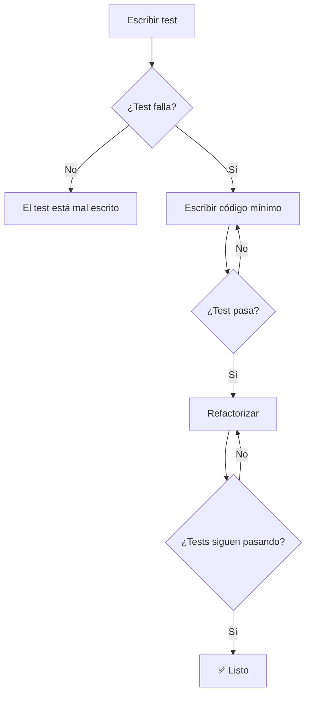
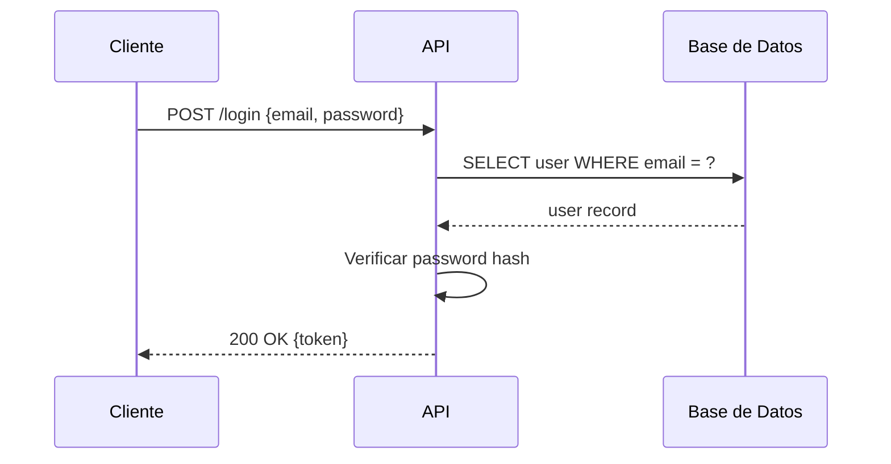
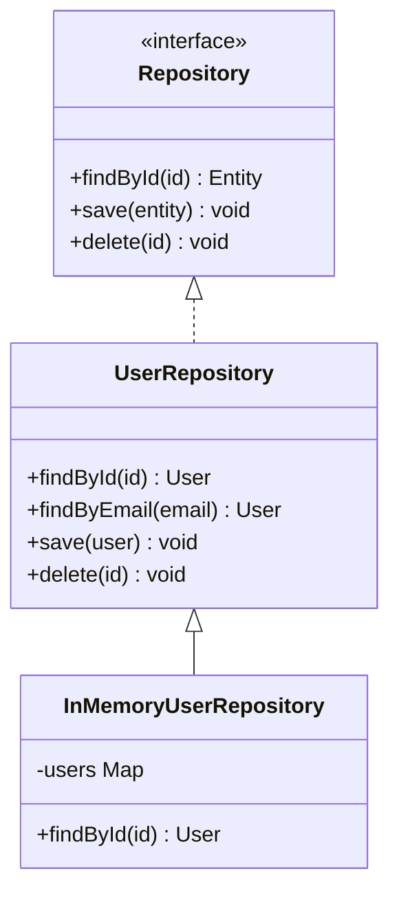
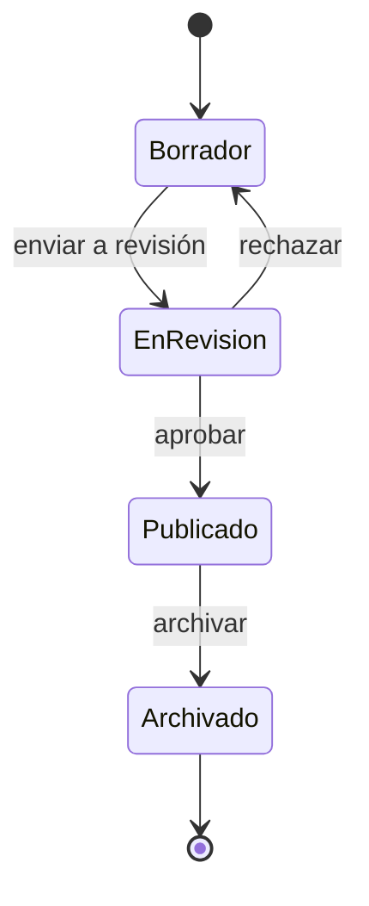
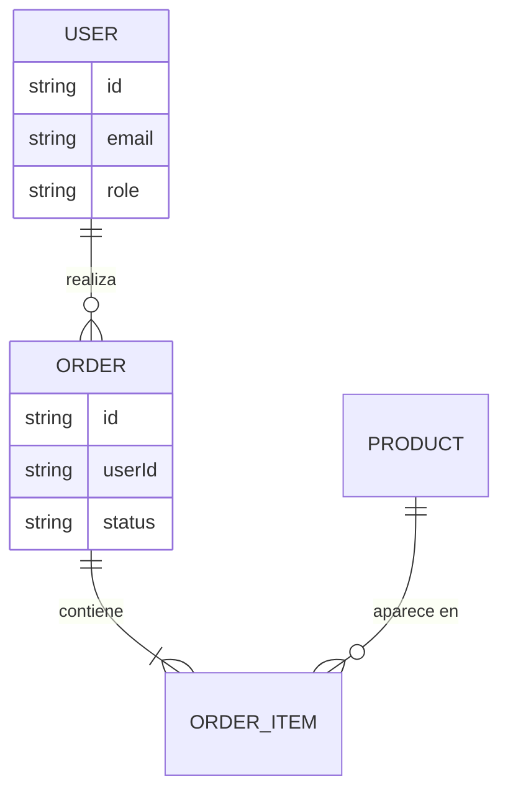

# Skill: NotebookLM Cuadernos

> Genera una **serie completa de documentos** sobre un tema de programación para usar en NotebookLM. Una serie es un conjunto de 5-7 archivos que juntos forman un corpus rico suficiente para generar podcasts, videos y material de estudio.

---

## Uso

```
Genera una serie de cuadernos sobre [tema] para NotebookLM
```

**Ejemplos:**

```
Genera una serie de cuadernos sobre TDD para NotebookLM

Genera una serie de cuadernos sobre Docker y containerización para NotebookLM

Genera una serie de cuadernos sobre patrones de diseño en TypeScript para NotebookLM

Genera una serie de cuadernos sobre autenticación y seguridad web para NotebookLM
```

---

## Parámetros

| Parámetro   | Descripción                        | Ejemplo          |
| ----------- | ---------------------------------- | ---------------- |
| `tema`      | Tema amplio a cubrir               | `TDD`            |
| `categoria` | Subcarpeta de destino (ver abajo)  | `testing`        |
| `nivel`     | Profundidad del contenido          | `intermedio`     |
| `diagramas` | Tipo de diagramas a usar           | `mermaid`        |

**Opciones de `diagramas`:**

| Valor    | Descripción                                                     | Cuándo usar                              |
| -------- | --------------------------------------------------------------- | ---------------------------------------- |
| `ascii`  | Diagramas con caracteres de texto (default)                     | Siempre legible, sin dependencias        |
| `mermaid`| Diagramas con sintaxis Mermaid, renderizables en GitHub/VS Code | Cuando se quiere visualización gráfica   |
| `ambos`  | Combinar ASCII para flujos simples y Mermaid para los complejos | Máxima claridad visual                   |

**Categorías:**

| Categoría         | Temas de ejemplo                                    |
| ----------------- | --------------------------------------------------- |
| `patrones`        | Design Patterns, SOLID, Clean Architecture, DDD     |
| `infraestructura` | Docker, CI/CD, Kubernetes, Networking               |
| `lenguajes`       | TypeScript avanzado, SQL, Rust, conceptos           |
| `arquitectura`    | Microservicios, Event-driven, CQRS, Monolito        |
| `testing`         | TDD, BDD, testing de integración, E2E               |
| `seguridad`       | OWASP, JWT, OAuth, autenticación                    |
| `bases-de-datos`  | Indexes, queries, ORM, migraciones, transacciones   |
| `ia`              | LLMs, prompting, agentes, flujos autónomos          |

---

## Estructura de Archivos a Generar

```
docs/NotebookLM/[categoria]/[tema]/
├── 00-indice.md              ← Mapa de la serie, resumen ejecutivo, glosario
├── 01-[subtema].md           ← Fundamentos / ¿Qué es y por qué existe?
├── 02-[subtema].md           ← Conceptos clave y mecanismos internos
├── 03-[subtema].md           ← Patrones, técnicas y aplicación práctica
├── 04-[subtema].md           ← Errores comunes, anti-patrones, trade-offs
├── 05-[subtema].md           ← Casos de uso reales y comparativas
└── prompts-notebooklm.md     ← Prompts listos para Audio Overview
```

**Mínimo**: 5 documentos + índice + prompts = 7 archivos
**El tema debe descomponerse** en ángulos o dimensiones distintas, no en capítulos secuenciales.

---

## Paso 1 — Descomponer el Tema en Documentos

Antes de escribir, definir qué cubre cada archivo. La descomposición ideal trata el tema desde **ángulos diferentes**, no como capítulos de un libro:

```
EJEMPLO — TDD:
──────────────────────────────────────────────────────
00-indice.md          → Mapa completo de la serie
01-fundamentos.md     → Qué es TDD, historia, ciclo RED/GREEN/REFACTOR
02-escribir-tests.md  → Cómo escribir buenos tests (AAA, naming, mocks)
03-tdd-en-practica.md → TDD en backends, frontends, APIs
04-trade-offs.md      → Cuándo usar TDD, cuándo no, críticas reales
05-casos-reales.md    → Ejemplos concretos de TDD completo
prompts.md            → Un prompt por documento para Audio Overview

EJEMPLO — Docker:
──────────────────────────────────────────────────────
00-indice.md               → Mapa
01-fundamentos.md          → Containers vs VMs, conceptos base
02-networking.md           → Redes en Docker, comunicación entre containers
03-compose-y-volumes.md    → Docker Compose, persistencia de datos
04-produccion.md           → Best practices, seguridad, optimización
05-casos-uso.md            → Patrones reales de uso en desarrollo
prompts.md                 → Prompts de audio
```

---

## Paso 2 — Estilo de Cada Documento

Cada documento debe seguir este estilo. **No es un template rígido** — las secciones emergen del contenido, pero el estilo es consistente.

### Encabezado

```markdown
# [Título descriptivo del subtema]

> [Una oración que dice exactamente qué aprende el lector en este documento]

---
```

### Opción A — Diagramas ASCII

Siempre legibles, sin dependencias de renderizado. Usar para flujos simples, comparaciones y arquitecturas.

```
┌─────────────────────────────────────────────┐
│ RED         GREEN         REFACTOR           │
│                                              │
│ Escribir  → Código mínimo → Limpiar código  │
│ test que    para que el     sin romper       │
│ FALLA       test PASE       tests            │
└─────────────────────────────────────────────┘
```

---

### Opción B — Diagramas Mermaid

Mermaid es un lenguaje de diagramas en texto que se renderiza visualmente en GitHub, VS Code, Obsidian y otras herramientas. Se escribe como bloque de código con el tag `mermaid`.

**Ventaja**: genera imágenes reales al renderizar. **Limitación**: no todos los visores lo soportan, pero el texto sigue siendo legible.

#### Tipos disponibles y cuándo usarlos:

**`flowchart` — Flujos y procesos**

Ideal para: ciclos de desarrollo, flujos de decisión, pipelines.

````markdown

````

**`sequenceDiagram` — Interacciones entre componentes**

Ideal para: comunicación cliente-servidor, llamadas a APIs, flujos de autenticación.

````markdown

````

**`classDiagram` — Estructuras y patrones OOP**

Ideal para: design patterns, herencia, composición, módulos.

````markdown

````

**`stateDiagram-v2` — Máquinas de estado**

Ideal para: ciclos de vida de entidades, estados de UI, flujos de autenticación.

````markdown

````

**`erDiagram` — Relaciones entre entidades**

Ideal para: modelado de datos, esquemas conceptuales, relaciones entre módulos.

````markdown

````

#### Guía de elección por tema:

| Tema del documento         | Tipo Mermaid recomendado          |
| -------------------------- | --------------------------------- |
| Ciclo TDD / CI/CD          | `flowchart`                       |
| Autenticación / OAuth      | `sequenceDiagram`                 |
| Design Patterns / SOLID    | `classDiagram`                    |
| Estados de una entidad     | `stateDiagram-v2`                 |
| Modelo de datos / DB       | `erDiagram`                       |
| Arquitectura de sistema    | `flowchart` con subgraphs         |
| Flujo de trabajo dev       | `flowchart` + `sequenceDiagram`   |

### Comparaciones ❌/✅

```markdown
❌ Sin TDD:
"Escribo el código, luego escribo tests para que pasen"
→ Los tests validan lo que el código hace, no lo que debería hacer

✅ Con TDD:
"Escribo el test que describe el comportamiento esperado, luego el código"
→ El código existe para hacer pasar el test, no al revés
```

### Tablas de referencia

```markdown
| Situación                    | Herramienta        | Por qué               |
| ---------------------------- | ------------------ | --------------------- |
| Unit test de función pura    | Jest / Vitest      | Rápido, aislado       |
| Test de componente React     | Testing Library    | Simula uso real       |
| Test de endpoint HTTP        | Supertest          | Prueba la API real    |
```

### Referencia Rápida al final

Cada documento termina con una sección `## Referencia Rápida` que resume los puntos clave en tablas o checklists. Es lo que NotebookLM usa para generar flashcards y resúmenes.

### Densidad de contenido

Cada documento debe tener:
- **Mínimo 300 líneas** de contenido real (no relleno)
- Al menos **3 bloques de código** con ejemplos reales
- Al menos **2 diagramas** (ASCII o Mermaid, según el parámetro `diagramas`)
- Al menos **1 tabla** de referencia
- Sección `## Referencia Rápida` al final

**Regla para Mermaid**: si el parámetro `diagramas` es `mermaid` o `ambos`, usar el tipo de diagrama apropiado según la tabla de elección. Si un diagrama Mermaid no aporta claridad sobre ASCII, usar ASCII.

---

## Paso 3 — Estructura del Índice (00-indice.md)

```markdown
# [Tema] — Índice de la Serie

> [Descripción de qué cubre la serie completa y a quién está dirigida]

---

## Documentos de esta Serie

| # | Documento | Tema |
|---|-----------|------|
| 01 | `01-xxx.md` | [qué cubre] |
| 02 | `02-xxx.md` | [qué cubre] |
...

---

## Resumen Ejecutivo

### ¿Qué Aprenderás?
[5-6 puntos concretos de conocimiento]

### Principios Fundamentales
[Los 3-5 principios del tema en diagrama o lista visual]

---

## Glosario Rápido

| Término | Definición |
|---------|------------|
| [término 1] | [definición concisa] |
...

---

## Cómo Usar Esta Serie

### Para Principiantes
[orden recomendado]

### Para Referencia Rápida
[cómo buscar temas específicos]
```

---

## Paso 4 — Estructura del Archivo de Prompts

```markdown
# Prompts para NotebookLM — Serie "[Tema]"

> Prompts para generar Audio Overview con NotebookLM basados en esta serie.

---

## Instrucciones de Uso
1. Subir TODOS los documentos de la serie como fuentes en un mismo cuaderno
2. Copiar el prompt del episodio deseado
3. Pegar en Audio Overview → Customize → Generate

---

## Episodio 0: Introducción a la Serie (Opcional)
**Documentos fuente:** `00-indice.md`
```
[prompt]
```

## Episodio 1: [Título]
**Documento fuente:** `01-xxx.md`
```
[prompt con: audiencia, puntos clave, estilo, tono, duración]
```

[Un episodio por documento]

---

## Episodio Completo (Alternativa)
**Documentos fuente:** Todos
```
[prompt que cubre toda la serie en 12-15 minutos]
```
```

---

## Reglas de Contenido

### Contenido genérico (obligatorio):
- Identificadores en ejemplos de código: `User`, `Order`, `Product`, `Service`, `Post`
- Tecnologías nombradas de forma genérica cuando sea posible
- Sin nombres de proyectos, empresas, personas ni URLs reales

### Excepciones permitidas:
- Nombrar tecnologías/frameworks cuando son el tema (ej: "en Docker", "en TypeScript")
- Citar herramientas de testing reales (Jest, Vitest, Playwright) cuando es relevante
- Referenciar conceptos con sus nombres estándar (SOLID, OWASP, REST, etc.)

### Calidad del contenido:
- Ejemplos de código que compilan o son sintácticamente válidos
- Comparativas honestas, incluyendo limitaciones y cuándo NO usar el tema
- Analogías que simplifican sin distorsionar el concepto real
- Errores comunes documentados porque realmente ocurren, no inventados

---

## Checklist de la Serie

Antes de considerar la serie completa:

- [ ] Mínimo 6 archivos generados (índice + 4 docs + prompts)
- [ ] Cada documento tiene mínimo 300 líneas de contenido real
- [ ] Cada documento tiene al menos 3 bloques de código
- [ ] Cada documento tiene al menos 2 diagramas (ASCII o Mermaid según parámetro)
- [ ] Si `diagramas=mermaid`: los tipos de diagrama corresponden al contenido (ver tabla de elección)
- [ ] Cada documento termina con `## Referencia Rápida`
- [ ] El índice tiene glosario y guía de uso de la serie
- [ ] El archivo de prompts tiene un prompt por documento + uno completo
- [ ] Ningún archivo referencia proyectos, datos o configs específicas
- [ ] Los documentos se complementan sin repetirse innecesariamente
