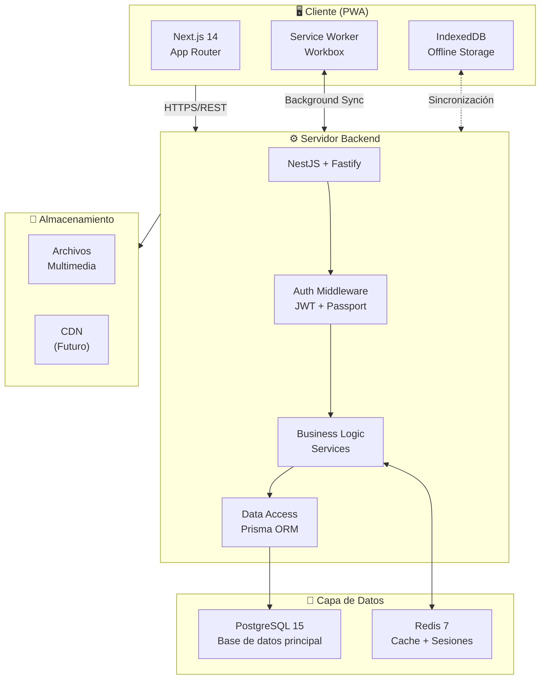
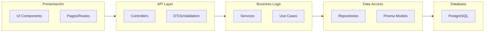
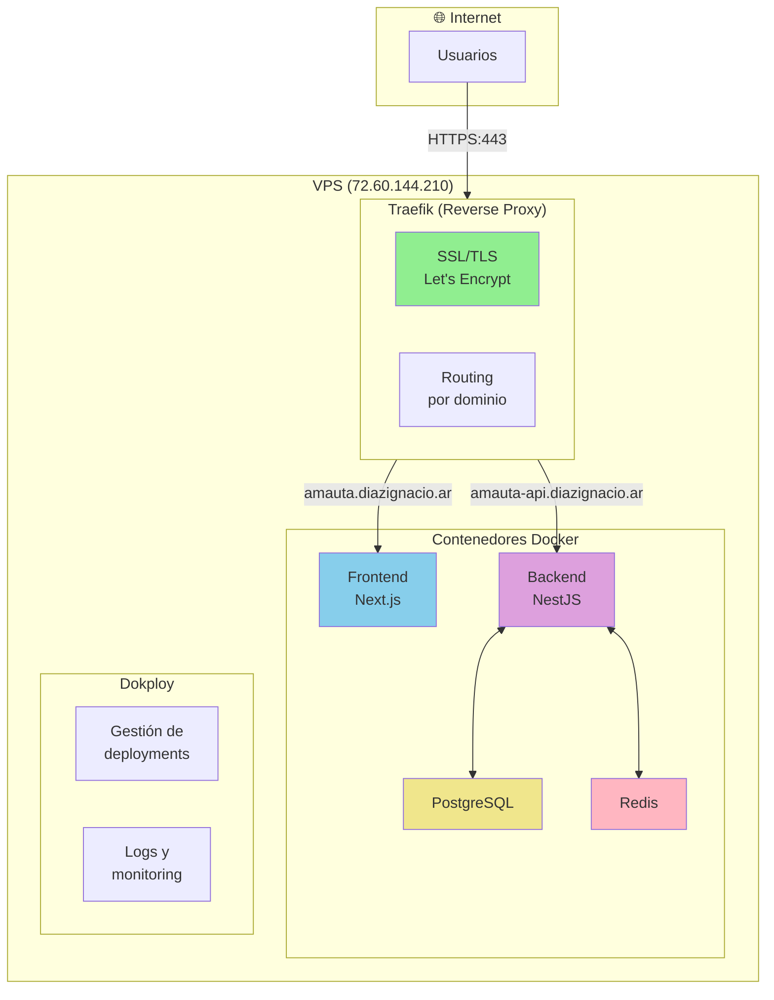
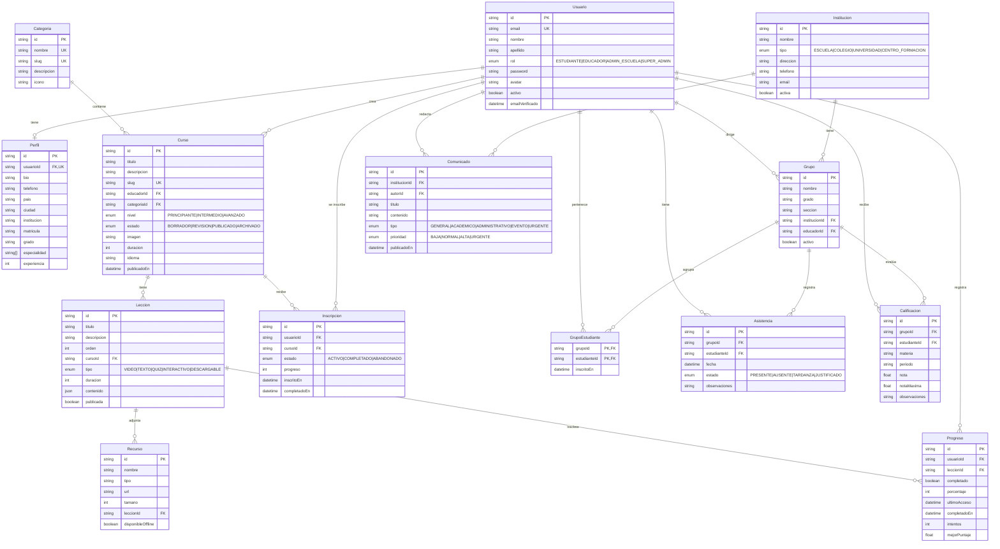

# Arquitectura del Sistema - Amauta

## Visión General

Amauta es una plataforma educativa progresiva (PWA) construida con una arquitectura moderna y modular que prioriza:

- **Accesibilidad universal**: Funciona en cualquier dispositivo con navegador
- **Offline-first**: Contenido disponible sin conexión a internet
- **Escalabilidad**: Diseñada para crecer con la comunidad
- **Mantenibilidad**: Código limpio y bien documentado

## Diagramas de Arquitectura

### Arquitectura General del Sistema



### Arquitectura en Capas



### Arquitectura de Deployment (Producción)



### Diagrama Entidad-Relación (ER)



### Diagrama de Flujo de Datos

```mermaid
flowchart TB
    subgraph Usuarios["👤 Flujo de Autenticación"]
        Login["Login<br/>(email + password)"]
        ValidarCreds["Validar<br/>credenciales"]
        GenerarJWT["Generar JWT<br/>+ Refresh Token"]
        GuardarSesion["Guardar sesión<br/>en Redis"]
        RetornarTokens["Retornar<br/>tokens"]

        Login --> ValidarCreds
        ValidarCreds -->|válido| GenerarJWT
        ValidarCreds -->|inválido| ErrorAuth["Error 401"]
        GenerarJWT --> GuardarSesion
        GuardarSesion --> RetornarTokens
    end

    subgraph Cursos["📚 Flujo de Inscripción"]
        SeleccionarCurso["Seleccionar<br/>curso"]
        VerificarRequisitos["Verificar<br/>requisitos"]
        CrearInscripcion["Crear<br/>inscripción"]
        InicializarProgreso["Inicializar<br/>progreso"]

        SeleccionarCurso --> VerificarRequisitos
        VerificarRequisitos -->|cumple| CrearInscripcion
        VerificarRequisitos -->|no cumple| ErrorReq["Error requisitos"]
        CrearInscripcion --> InicializarProgreso
    end

    subgraph Aprendizaje["🎯 Flujo de Progreso"]
        AccederLeccion["Acceder a<br/>lección"]
        RegistrarActividad["Registrar<br/>actividad"]
        ActualizarProgreso["Actualizar<br/>progreso lección"]
        RecalcularCurso["Recalcular<br/>progreso curso"]
        VerificarCompletado["¿Curso<br/>completado?"]
        MarcarCompletado["Marcar curso<br/>como completado"]

        AccederLeccion --> RegistrarActividad
        RegistrarActividad --> ActualizarProgreso
        ActualizarProgreso --> RecalcularCurso
        RecalcularCurso --> VerificarCompletado
        VerificarCompletado -->|Sí| MarcarCompletado
        VerificarCompletado -->|No| AccederLeccion
    end

    subgraph Offline["📴 Flujo Offline"]
        AccionUsuario["Acción del<br/>usuario"]
        VerificarRed["¿Hay<br/>conexión?"]
        EnviarAPI["Enviar a<br/>API"]
        GuardarLocal["Guardar en<br/>IndexedDB"]
        ColaSync["Agregar a cola<br/>de sincronización"]
        BackgroundSync["Background Sync<br/>(cuando hay red)"]
        SincronizarDatos["Sincronizar<br/>con servidor"]

        AccionUsuario --> VerificarRed
        VerificarRed -->|Sí| EnviarAPI
        VerificarRed -->|No| GuardarLocal
        GuardarLocal --> ColaSync
        ColaSync -.->|Red disponible| BackgroundSync
        BackgroundSync --> SincronizarDatos
        SincronizarDatos --> EnviarAPI
    end
```



## Stack Tecnológico

### Frontend

- **Framework**: Next.js 14+ (App Router)
- **Lenguaje**: TypeScript
- **UI**: Tailwind CSS + Radix UI / shadcn/ui
- **Estado**: Zustand para estado global
- **Offline**: Workbox + IndexedDB
- **Validación**: Zod
- **Formularios**: React Hook Form

### Backend

- **Runtime**: Node.js 20+
- **Framework**: NestJS (con adaptador Fastify)
- **Lenguaje**: TypeScript (strict mode)
- **ORM**: Prisma
- **Autenticación**: Passport.js (JWT strategy)
- **Validación**: Zod + class-validator
- **API**: RESTful (GraphQL opcional futuro)
- **Arquitectura**: Modular (controllers, services, repositories)

### Base de Datos

- **Principal**: PostgreSQL 15+
- **Caché**: Redis 7+ (configurado, en uso desde Fase 1)
- **Búsqueda**: PostgreSQL Full-Text Search (Elasticsearch futuro)

### DevOps

- **Desarrollo Local**: Docker + Docker Compose (obligatorio)
- **Deployment**: Dokploy en VPS
- **CI/CD**: GitHub Actions
- **Monitoreo**: (A definir - Fase 1)
- **Logs**: Pino (recomendado para NestJS + Fastify)

## Patrones de Arquitectura

### 1. Arquitectura en Capas

```
┌─────────────────────────────────┐
│  Presentation Layer (Next.js)   │  ← UI Components, Pages
├─────────────────────────────────┤
│  API Layer (REST Endpoints)     │  ← Controllers, Routes
├─────────────────────────────────┤
│  Business Logic Layer           │  ← Services, Use Cases
├─────────────────────────────────┤
│  Data Access Layer (Prisma)     │  ← Repositories, Models
├─────────────────────────────────┤
│  Database (PostgreSQL)           │  ← Persistent Storage
└─────────────────────────────────┘
```

### 2. Estrategia Offline-First

**Service Worker** intercepta requests:

1. **Cache First**: Recursos estáticos (CSS, JS, imágenes)
2. **Network First**: Contenido dinámico (cursos, usuarios)
3. **Stale While Revalidate**: Contenido semi-estático (catálogo de cursos)

**IndexedDB** almacena:

- Contenido de cursos descargados
- Progreso del estudiante
- Datos pendientes de sincronización

**Sincronización**:

- Background Sync API para operaciones offline
- Conflict resolution para datos modificados offline

### 3. Módulos Principales

#### Módulo de Usuarios y Autenticación

- Registro y autenticación
- Perfiles (estudiante, educador, administrador)
- Roles y permisos

#### Módulo de Cursos

- Creación y gestión de cursos
- Estructura de lecciones y unidades
- Multimedia (videos, documentos, interactivos)
- Descarga para offline

#### Módulo de Aprendizaje

- Seguimiento de progreso
- Sistema de evaluaciones
- Certificaciones
- Gamificación (opcional)

#### Módulo Administrativo Escolar

- Gestión de asistencias
- Registro de calificaciones
- Comunicados y notificaciones
- Reportes académicos

#### Módulo de Comunidad

- Foros de discusión
- Mensajería
- Grupos de estudio
- Colaboración

## Seguridad

### Principios

- Autenticación JWT con refresh tokens
- HTTPS obligatorio en producción
- Sanitización de inputs
- Rate limiting
- CORS configurado
- CSP (Content Security Policy)

### Niveles de Acceso

1. **Público**: Navegación de catálogo
2. **Estudiante**: Acceso a cursos, seguimiento
3. **Educador**: Creación de contenido, seguimiento de alumnos
4. **Administrador Escolar**: Gestión administrativa completa
5. **Super Admin**: Configuración del sistema

## Escalabilidad

### Horizontal

- Backend stateless (sesiones en Redis)
- Load balancer compatible
- Microservicios opcionales para módulos específicos

### Vertical

- Optimización de queries (índices, vistas materializadas)
- Caché estratégico en múltiples niveles
- CDN para contenido estático

### Base de Datos

- Particionamiento por institución educativa
- Read replicas para reportes
- Archivado de datos históricos

## Performance

### Frontend

- Code splitting automático (Next.js)
- Lazy loading de componentes
- Optimización de imágenes (next/image)
- Prefetching estratégico

### Backend

- Caché de queries frecuentes
- Paginación de resultados
- Compresión gzip/brotli
- Connection pooling

## Consideraciones de Diseño

### Accesibilidad (a11y)

- WCAG 2.1 AA compliance
- Navegación por teclado
- Screen reader friendly
- Alto contraste disponible

### Internacionalización (i18n)

- Soporte multi-idioma (español prioritario)
- Idiomas originarios (quechua, aymara, guaraní)
- RTL support preparado

### Responsive Design

- Mobile-first approach
- Breakpoints: móvil, tablet, desktop
- Touch-friendly interactions

## Decisiones Técnicas Clave

### ¿Por qué NestJS + Fastify?

**NestJS** fue elegido como framework backend porque:

- **Arquitectura enterprise**: Estructura modular escalable desde el inicio
- **TypeScript first-class**: Máxima integración con Prisma y el ecosistema TS
- **Dependency Injection**: Facilita testing, mantenimiento y escalabilidad
- **Decoradores**: Código declarativo y limpio
- **Ecosystem maduro**: Gran cantidad de librerías y patterns establecidos
- **Documentación excelente**: Swagger/OpenAPI integrado

**Fastify** como adaptador (en lugar de Express por defecto) porque:

- **Performance**: ~30-50% más rápido que Express
- **Schema validation nativa**: Validación JSON Schema integrada
- **TypeScript support**: Mejor soporte TypeScript que Express
- **Plugins modernos**: Ecosystem creciente y moderno

**Alternativas consideradas**:

- ❌ **Express puro**: Framework minimalista y maduro
  - **Pros**: Simple, maduro, enorme ecosystem
  - **Contras**: Sin estructura, demasiada libertad lleva a inconsistencias
  - **Rechazo**: Necesitamos estructura desde el inicio para equipo distribuido

- ❌ **Fastify puro**: Framework rápido y moderno
  - **Pros**: Excelente performance, plugins modernos
  - **Contras**: Requiere setup manual de DI, validación, estructura modular
  - **Rechazo**: Reinventar patrones ya resueltos por NestJS

- ❌ **Hono/Elyse (edge runtimes)**: Frameworks ultra-rápidos
  - **Pros**: Performance extrema, edge-ready
  - **Contras**: Ecosystem inmaduro, menos librerías
  - **Rechazo**: Prematuro para nuestras necesidades actuales

- ❌ **tRPC**: Type-safe RPC sin REST
  - **Pros**: End-to-end type safety increíble
  - **Contras**: Acoplamiento frontend-backend, no estándar
  - **Rechazo**: Preferimos REST estándar + OpenAPI para flexibilidad futura

- ✅ **NestJS + Fastify**: Mejor de ambos mundos
  - **Pros**: Estructura + Performance + TypeScript + Testing
  - **Contras**: Curva de aprendizaje inicial moderada
  - **Elección**: Balance ideal para proyecto educativo de largo plazo

### ¿Por qué Next.js App Router?

**Next.js 14+** fue elegido como framework frontend porque:

- **Server Components**: Reduce bundle JS, mejor SEO y performance
- **Server Actions**: Mutaciones type-safe sin API routes
- **Streaming SSR**: UI progressive loading con Suspense
- **File-based routing**: Convención sobre configuración
- **PWA ready**: Service Worker + Manifest + Workbox integration
- **Optimización automática**: Imágenes, fonts, code splitting
- **Ecosystem maduro**: Vercel, gran comunidad, documentación excelente

**App Router vs Pages Router**:

- ✅ **App Router**: Nueva arquitectura (elegido)
  - Server Components por defecto
  - Layouts anidados
  - Streaming y Suspense nativos
  - Mejor DX para data fetching

- ❌ **Pages Router**: Arquitectura clásica
  - Client Components por defecto (más JS al cliente)
  - Layouts mediante componentes custom
  - Sin streaming nativo
  - Rechazo: Arquitectura legacy

**Alternativas consideradas**:

- ❌ **Remix**: Framework full-stack moderno
  - **Pros**: Excelente manejo de forms, progressive enhancement
  - **Contras**: Ecosystem más pequeño que Next.js
  - **Rechazo**: Next.js tiene mejor soporte PWA y más momentum

- ❌ **Astro**: Static-first framework
  - **Pros**: Performance increíble para sitios estáticos
  - **Contras**: Menos adecuado para aplicaciones dinámicas
  - **Rechazo**: Necesitamos app interactiva, no sitio estático

- ❌ **SvelteKit**: Framework con Svelte
  - **Pros**: Bundle pequeño, sintaxis elegante
  - **Contras**: Ecosystem más pequeño, menos librerías UI
  - **Rechazo**: React tiene más librerías educativas y UI components

- ❌ **Nuxt (Vue)**: Framework Vue equivalent
  - **Pros**: Vue es más simple que React
  - **Contras**: Ecosystem React más grande para educación
  - **Rechazo**: React tiene más recursos educativos y componentes PWA

### ¿Por qué PostgreSQL?

**PostgreSQL 15+** fue elegido como base de datos principal porque:

- **ACID compliance**: Datos académicos críticos requieren transacciones confiables
- **Full-Text Search**: Búsqueda nativa en español sin dependencias externas
- **JSONB support**: Flexibilidad para datos semi-estructurados (configuraciones, metadata)
- **Arrays y tipos avanzados**: Ideal para tags, categorías, permisos
- **Extensiones**: PostGIS (futuro para geolocalización), pg_trgm (fuzzy search)
- **Performance**: Excelente para reads con índices apropiados
- **Open source**: Sin vendor lock-in, comunidad enorme

**Alternativas consideradas**:

- ❌ **MySQL/MariaDB**: Base de datos popular
  - **Pros**: Muy popular, fácil de encontrar hosting
  - **Contras**: Full-text search inferior, menos tipos de datos avanzados
  - **Rechazo**: PostgreSQL superior técnicamente para nuestro caso

- ❌ **MongoDB**: Base de datos NoSQL
  - **Pros**: Esquema flexible, bueno para prototipado rápido
  - **Contras**: Sin transacciones ACID robustas, schema drift en equipo grande
  - **Rechazo**: Datos académicos son relacionales por naturaleza

- ❌ **SQLite**: Base de datos embedded
  - **Pros**: Cero configuración, perfecto para local dev
  - **Contras**: No soporta múltiples escrituras concurrentes
  - **Rechazo**: No escala para producción multi-usuario

- ❌ **Supabase (PostgreSQL as service)**: PostgreSQL managed
  - **Pros**: Backend-as-a-service, auth incluido, realtime
  - **Contras**: Vendor lock-in, costo a escala
  - **Rechazo**: Preferimos control total con self-hosted en VPS

- ❌ **PlanetScale (MySQL as service)**: MySQL serverless
  - **Pros**: Branching de base de datos, serverless
  - **Contras**: MySQL (menos features), costo
  - **Rechazo**: PostgreSQL self-hosted más económico y poderoso

### ¿Por qué Prisma ORM?

**Prisma** fue elegido como ORM porque:

- **Type-safety end-to-end**: Client generado desde schema
- **Schema declarativo**: Migraciones automáticas desde schema.prisma
- **Developer experience**: Autocompletado increíble, errores en compile-time
- **Prisma Studio**: GUI para inspeccionar datos
- **Migrations robustas**: Sistema de migraciones confiable

**Alternativas consideradas**:

- ❌ **TypeORM**: ORM maduro con decoradores
  - **Pros**: Muy maduro, soporta Active Record + Data Mapper
  - **Contras**: TypeScript support inferior, migraciones manuales
  - **Rechazo**: Developer experience inferior a Prisma

- ❌ **Drizzle ORM**: ORM type-safe moderno
  - **Pros**: Muy rápido, type-safe, SQL-like API
  - **Contras**: Ecosystem joven, menos tooling
  - **Rechazo**: Prisma más maduro para proyecto largo plazo

- ❌ **Kysely**: Type-safe SQL query builder
  - **Pros**: SQL puro con type-safety
  - **Contras**: Más verbose, sin schema management integrado
  - **Rechazo**: Preferimos abstracción de Prisma

- ❌ **SQL puro con pg**: Driver PostgreSQL nativo
  - **Pros**: Máximo control, cero overhead
  - **Contras**: Sin type-safety, migraciones manuales, boilerplate
  - **Rechazo**: Productividad > control absoluto

### ¿Por qué Redis?

**Redis 7+** fue elegido para caché y sesiones porque:

- **Performance**: Submilisegundos de latencia
- **Versatilidad**: Cache, sessions, pub/sub, queues
- **Persistence opcional**: RDB + AOF para durabilidad
- **Simple**: API simple, fácil de operar
- **Maduro**: Probado en producción a escala

**Alternativas consideradas**:

- ❌ **In-memory cache (node-cache)**: Cache en proceso
  - **Pros**: Cero configuración
  - **Contras**: No compartido entre instancias, se pierde en restart
  - **Rechazo**: No escala horizontalmente

- ❌ **Memcached**: Sistema de caché distribuido
  - **Pros**: Muy rápido, simple
  - **Contras**: Solo caché (no pub/sub ni queues), menos features
  - **Rechazo**: Redis más versátil

- ❌ **Valkey (Redis fork)**: Fork open source de Redis
  - **Pros**: Totalmente open source sin restricciones de licencia
  - **Contras**: Fork reciente, menos maduro
  - **Rechazo**: Redis 7 BSD-licensed es suficiente para nuestro uso

### ¿Por qué Offline-First?

**Offline-First** fue elegido como estrategia arquitectónica porque:

**Contexto educativo latinoamericano**:

- Muchas escuelas rurales tienen conectividad intermitente o inexistente
- Estudiantes pueden no tener datos móviles constantes
- Educadores necesitan acceso confiable en cualquier contexto
- Desastres naturales pueden cortar conectividad por días

**Ventajas técnicas**:

- **Resiliencia**: App funciona sin importar estado de red
- **Performance**: Contenido local siempre es instantáneo
- **UX superior**: Sin spinners de carga, sin "offline" screens
- **Sincronización eventual**: Cambios se sincronizan cuando hay red

**Estrategia de implementación**:

1. **Service Worker**: Intercepción de requests, caché estratégico
2. **IndexedDB**: Almacenamiento local de cursos, progreso, evaluaciones
3. **Background Sync**: Cola de operaciones pendientes cuando vuelve la red
4. **Conflict Resolution**: Estrategias para resolver conflictos de sincronización

**Alternativas consideradas**:

- ❌ **Online-only**: Requiere conexión constante
  - **Pros**: Más simple de implementar
  - **Contras**: Excluye a usuarios con mala conectividad
  - **Rechazo**: No cumple misión de acceso universal

- ❌ **Offline básico (solo caché)**: Solo caché de assets
  - **Pros**: Más simple que offline-first completo
  - **Contras**: No permite uso real sin conexión
  - **Rechazo**: Insuficiente para nuestro contexto

- ❌ **Native apps (React Native/Flutter)**: Apps nativas
  - **Pros**: Mejor integración con device, offline nativo
  - **Contras**: Dos codebases (iOS/Android), deployment a stores
  - **Rechazo**: PWA logra 90% de beneficios con 30% del esfuerzo

### ¿Por qué Monorepo con Turborepo?

**Turborepo** fue elegido para gestionar el monorepo porque:

- **Build cache**: Cache local y remoto para builds
- **Pipeline de tareas**: Orquestación de builds, tests, lint
- **Paralelización**: Builds paralelos donde es posible
- **Incremental builds**: Solo rebuilds lo que cambió
- **Simple**: Menos configuración que Nx o Bazel

**Monorepo vs Multi-repo**:

- ✅ **Monorepo**: Un repositorio, múltiples packages
  - **Pros**: Refactors atómicos, versionado unificado, code sharing fácil
  - **Contras**: Repo grande, CI más complejo
  - **Elección**: Pros superan contras para nuestra escala

- ❌ **Multi-repo**: Repositorios separados
  - **Pros**: Independencia total, CI simple
  - **Contras**: Code sharing difícil, versionado complejo, refactors fragmentados
  - **Rechazo**: Overhead de coordinación demasiado alto

**Alternativas consideradas**:

- ❌ **Nx**: Monorepo tool de Nrwl
  - **Pros**: Muy poderoso, code generation, graph visualization
  - **Contras**: Configuración compleja, curva de aprendizaje alta
  - **Rechazo**: Turborepo más simple para nuestro tamaño

- ❌ **npm workspaces solo**: Sin herramienta adicional
  - **Pros**: Cero configuración adicional
  - **Contras**: Sin build cache, sin pipeline orquestación
  - **Rechazo**: Turborepo agrega valor significativo

- ❌ **Bazel/Buck**: Build systems enterprise
  - **Pros**: Performance extrema, usado en Google/Facebook
  - **Contras**: Complejidad extrema, curva de aprendizaje vertical
  - **Rechazo**: Overkill para nuestro proyecto

### ¿Por qué Docker obligatorio en desarrollo?

**Docker + Docker Compose** obligatorio porque:

- **Consistencia**: Mismo entorno para todos los desarrolladores
- **Servicios múltiples**: PostgreSQL + Redis configurados automáticamente
- **Aislamiento**: No contaminar sistema local con servicios
- **Paridad desarrollo/producción**: Mismo stack que en VPS
- **Onboarding rápido**: `docker-compose up -d` y listo
- **Versiones específicas**: PostgreSQL 15, Redis 7, sin conflictos

**Alternativas consideradas**:

- ❌ **Instalación local de servicios**: PostgreSQL y Redis en sistema
  - **Pros**: Más rápido (sin virtualización)
  - **Contras**: Versiones diferentes, conflictos, difícil onboarding
  - **Rechazo**: Pesadilla de "works on my machine"

- ❌ **Docker opcional**: Permitir ambos
  - **Pros**: Flexibilidad para desarrolladores
  - **Contras**: Fragmentación, soporte de múltiples setups
  - **Rechazo**: Soporte es muy costoso

- ❌ **Cloud dev environments (Gitpod/Codespaces)**: Desarrollo en cloud
  - **Pros**: Cero setup local
  - **Contras**: Requiere conexión constante, costo
  - **Rechazo**: Ironico para proyecto offline-first

### ¿Por qué Dokploy para deployment?

**Dokploy** fue elegido para deployment en VPS porque:

- **Self-hosted**: Control total de infraestructura
- **Open source**: Sin vendor lock-in
- **Docker-based**: Mismo stack que desarrollo
- **UI friendly**: No requiere ser DevOps expert
- **Traefik integrado**: SSL automático con Let's Encrypt
- **Costo**: VPS propio vs PaaS mensual

**Alternativas consideradas**:

- ❌ **Vercel**: PaaS para Next.js
  - **Pros**: Deploy automático, edge functions, CDN global
  - **Contras**: Backend separado, costo a escala, vendor lock-in
  - **Rechazo**: Necesitamos control de backend

- ❌ **Railway/Render**: PaaS modernos
  - **Pros**: Simple, buen DX
  - **Contras**: Costo mensual creciente, menos control
  - **Rechazo**: VPS propio más económico largo plazo

- ❌ **CapRover**: Alternativa a Dokploy
  - **Pros**: Similar a Dokploy, maduro
  - **Contras**: UI menos moderna
  - **Rechazo**: Dokploy más activo y moderno

- ❌ **Coolify**: Alternativa a Dokploy
  - **Pros**: Open source, popular
  - **Contras**: Menos features que Dokploy
  - **Rechazo**: Dokploy tiene mejor integración

- ❌ **Kubernetes (k3s/k8s)**: Orquestación enterprise
  - **Pros**: Escalabilidad extrema, industry standard
  - **Contras**: Complejidad extrema, overkill
  - **Rechazo**: No necesitamos esa escala aún

- ❌ **Docker Swarm**: Orquestación Docker nativa
  - **Pros**: Más simple que Kubernetes
  - **Contras**: Menos momentum, requiere setup manual
  - **Rechazo**: Dokploy abstrae complejidad con UI

### ¿Por qué Zod para validación?

**Zod** fue elegido para validación porque:

- **Type inference**: Tipos TypeScript desde schemas
- **Runtime validation**: Validación en runtime + compile-time
- **Composable**: Schemas complejos desde primitivos
- **Error messages**: Mensajes customizables
- **Ecosystem**: Integración con React Hook Form, tRPC, Prisma

**Alternativas consideradas**:

- ❌ **Yup**: Librería de validación clásica
  - **Pros**: Muy madura, bien conocida
  - **Contras**: TypeScript support inferior
  - **Rechazo**: Zod mejor para TypeScript-first

- ❌ **Joi**: Validación Node.js clásica
  - **Pros**: Muy madura
  - **Contras**: Sin type inference
  - **Rechazo**: Diseñado para JavaScript, no TypeScript

- ❌ **class-validator**: Validación con decoradores
  - **Pros**: Bien integrado con NestJS
  - **Contras**: Requiere classes, menos flexible
  - **Nota**: Usamos ambos - Zod para shared schemas, class-validator en NestJS DTOs

- ❌ **TypeBox**: JSON Schema con type inference
  - **Pros**: Performance excelente
  - **Contras**: API menos ergonómica
  - **Rechazo**: Zod mejor DX

## Patrones de Escalabilidad

### Estrategia de Crecimiento

La arquitectura está diseñada para escalar en múltiples dimensiones:

#### 1. Escalabilidad de Usuarios

**Fase actual (0-10k usuarios)**:

- Single server (VPS actual)
- PostgreSQL + Redis en mismo servidor
- Sin CDN (archivos servidos por backend)

**Fase media (10k-100k usuarios)**:

- Load balancer (Traefik ya incluido en Dokploy)
- Múltiples instancias de backend (stateless)
- Redis separado para sesiones compartidas
- CDN para assets estáticos (CloudFlare free tier)
- Read replicas de PostgreSQL para reportes

**Fase alta (100k+ usuarios)**:

- CDN global para contenido multimedia
- PostgreSQL con particionamiento por institución
- Redis Cluster para alta disponibilidad
- Microservicios opcionales para módulos pesados (evaluaciones, videoconferencia)
- Queue system (BullMQ con Redis) para tareas asíncronas

#### 2. Escalabilidad de Datos

**Estrategias implementables**:

```sql
-- Particionamiento por institución educativa
CREATE TABLE cursos_institucion_1 PARTITION OF cursos
FOR VALUES IN (1);

CREATE TABLE cursos_institucion_2 PARTITION OF cursos
FOR VALUES IN (2);

-- Índices estratégicos
CREATE INDEX idx_estudiantes_curso ON inscripciones(curso_id, estado)
WHERE estado = 'ACTIVA';

CREATE INDEX idx_cursos_busqueda ON cursos
USING GIN(to_tsvector('spanish', titulo || ' ' || descripcion));
```

**Archivado de datos históricos**:

- Cursos finalizados > 2 años → tabla de archivo
- Calificaciones > 5 años → almacenamiento frío
- Logs de auditoría → rotación automática

#### 3. Escalabilidad de Performance

**Backend caching strategy**:

```typescript
// apps/api/src/common/cache/cache.service.ts
import { Injectable } from '@nestjs/common';
import { Redis } from 'ioredis';

@Injectable()
export class CacheService {
  constructor(private readonly redis: Redis) {}

  // Caché de catálogo de cursos (TTL 1 hora)
  async getCursosCatalogo(): Promise<Curso[]> {
    const cached = await this.redis.get('catalogo:cursos');
    if (cached) return JSON.parse(cached);

    const cursos = await this.prisma.curso.findMany({
      where: { publicado: true },
    });

    await this.redis.setex('catalogo:cursos', 3600, JSON.stringify(cursos));

    return cursos;
  }

  // Invalidación selectiva
  async invalidarCursoCatalogo(cursoId: string): Promise<void> {
    await this.redis.del('catalogo:cursos');
    await this.redis.del(`curso:${cursoId}:detalles`);
  }
}
```

**Database query optimization**:

```typescript
// ❌ N+1 query problem
const cursos = await prisma.curso.findMany();
for (const curso of cursos) {
  const educador = await prisma.usuario.findUnique({
    where: { id: curso.educadorId },
  });
}

// ✅ Single query with include
const cursos = await prisma.curso.findMany({
  include: {
    educador: {
      select: { id: true, nombre: true, email: true },
    },
    _count: { select: { estudiantes: true } },
  },
});
```

**Rate limiting**:

```typescript
// apps/api/src/common/guards/throttle.guard.ts
import { ThrottlerGuard } from '@nestjs/throttler';

// Configuración global en app.module.ts
@Module({
  imports: [
    ThrottlerModule.forRoot({
      ttl: 60, // 60 segundos
      limit: 100, // 100 requests máx
    }),
  ],
})
// Aplicar a endpoints públicos
@Controller('auth')
@UseGuards(ThrottlerGuard)
@Throttle(5, 60) // 5 intentos por minuto
export class AuthController {
  @Post('login')
  async login(@Body() loginDto: LoginDto) {
    // ...
  }
}
```

### Arquitectura de Deployment Actual

```
┌─────────────────────────────────────────────────────┐
│                  VPS (72.60.144.210)                 │
│                                                      │
│  ┌────────────────────────────────────────────────┐ │
│  │           Traefik (Reverse Proxy)              │ │
│  │  - SSL/TLS automático (Let's Encrypt)          │ │
│  │  - Routing por dominio                         │ │
│  └────────────────────────────────────────────────┘ │
│         │                              │             │
│         │                              │             │
│  ┌──────▼──────┐              ┌───────▼──────┐     │
│  │  Frontend   │              │   Backend    │     │
│  │  (Next.js)  │              │   (NestJS)   │     │
│  │  Container  │              │  Container   │     │
│  └─────────────┘              └──────┬───────┘     │
│                                      │             │
│  ┌──────────────────────────────────┼───────────┐ │
│  │          Data Layer               │           │ │
│  │  ┌──────────────┐    ┌───────────▼────────┐  │ │
│  │  │  PostgreSQL  │    │      Redis         │  │ │
│  │  │  Container   │    │    Container       │  │ │
│  │  └──────────────┘    └────────────────────┘  │ │
│  └──────────────────────────────────────────────┘ │
│                                                    │
│  ┌──────────────────────────────────────────────┐ │
│  │              Dokploy UI                       │ │
│  │  - Gestión de deployments                    │ │
│  │  - Logs y monitoring                         │ │
│  │  - Variables de entorno                      │ │
│  └──────────────────────────────────────────────┘ │
└────────────────────────────────────────────────────┘
         ▲
         │ HTTPS (443)
         │
  ┌──────┴──────┐
  │   Internet  │
  └─────────────┘
```

### Consideraciones de Seguridad en Escala

#### Application Security

**Sanitización de inputs**:

```typescript
import { Injectable } from '@nestjs/common';
import * as sanitizeHtml from 'sanitize-html';

@Injectable()
export class SanitizationService {
  sanitizeUserContent(content: string): string {
    return sanitizeHtml(content, {
      allowedTags: ['b', 'i', 'em', 'strong', 'a', 'p', 'br'],
      allowedAttributes: {
        a: ['href', 'title'],
      },
      allowedSchemes: ['http', 'https', 'mailto'],
    });
  }
}
```

**SQL Injection protection**:

- Prisma ORM previene SQL injection automáticamente
- Nunca usar raw queries con inputs de usuario
- Si es necesario raw SQL, usar prepared statements

```typescript
// ✅ SEGURO - Prisma parametriza automáticamente
const usuario = await prisma.usuario.findFirst({
  where: { email: userInput },
});

// ⚠️ PELIGROSO - Solo si es absolutamente necesario
const result = await prisma.$queryRaw`
  SELECT * FROM usuarios WHERE email = ${userInput}
`;

// ❌ NUNCA HACER ESTO
const result = await prisma.$queryRawUnsafe(
  `SELECT * FROM usuarios WHERE email = '${userInput}'`
);
```

**XSS Protection**:

```typescript
// Next.js escapa automáticamente en JSX
<div>{userContent}</div>  // Seguro por defecto

// Para HTML dinámico, sanitizar primero
import DOMPurify from 'isomorphic-dompurify';

function UserContent({ html }: { html: string }) {
  const clean = DOMPurify.sanitize(html);
  return <div dangerouslySetInnerHTML={{ __html: clean }} />;
}
```

**CSRF Protection**:

```typescript
// apps/api/src/main.ts
import { NestFactory } from '@nestjs/core';
import * as csurf from 'csurf';

async function bootstrap() {
  const app = await NestFactory.create(AppModule);

  // CSRF para operaciones mutativas
  app.use(csurf({ cookie: true }));

  await app.listen(4000);
}
```

#### Infrastructure Security

**Secrets management**:

- Variables sensibles en Dokploy (encriptadas)
- NUNCA commits de secrets al repositorio
- Rotación periódica de secrets de producción
- Acceso SSH solo con claves, no passwords

**Network security**:

```bash
# Firewall en VPS (UFW)
ufw default deny incoming
ufw default allow outgoing
ufw allow 22/tcp      # SSH
ufw allow 80/tcp      # HTTP (redirect a HTTPS)
ufw allow 443/tcp     # HTTPS
ufw allow 3000/tcp    # Dokploy UI (solo IP autorizada)
ufw enable
```

**Database security**:

```sql
-- Usuario de aplicación con permisos limitados
CREATE USER amauta_app WITH PASSWORD 'strong_password';
GRANT SELECT, INSERT, UPDATE, DELETE ON ALL TABLES IN SCHEMA public TO amauta_app;
REVOKE DROP, TRUNCATE ON ALL TABLES IN SCHEMA public FROM amauta_app;

-- Conexión solo desde localhost
-- postgresql.conf: listen_addresses = 'localhost'
-- pg_hba.conf: host all amauta_app 127.0.0.1/32 scram-sha-256
```

### Monitoring y Observabilidad (Futuro)

Cuando el proyecto crezca, implementar:

**Logging estructurado**:

```typescript
import { Logger } from '@nestjs/common';
import * as pino from 'pino';

const logger = pino({
  level: process.env.LOG_LEVEL || 'info',
  transport: {
    target: 'pino-pretty',
    options: { colorize: true },
  },
});

logger.info({ userId, action: 'course.enroll' }, 'Usuario inscrito en curso');
```

**Metrics** (Prometheus + Grafana):

- Request rate, latency, error rate
- Database connection pool usage
- Redis hit/miss ratio
- Active users concurrentes

**Alerting**:

- Error rate > 5% → Notificar
- Response time p95 > 2s → Notificar
- Database connections > 80% → Notificar
- Disco > 85% usado → Notificar

**APM (Application Performance Monitoring)**:

- Considerar: OpenTelemetry, Sentry, New Relic
- Tracing de requests lentos
- Identificación de N+1 queries
- Memory leaks detection

## Flujo de Desarrollo

### Entorno Local (Desarrollo)

```bash
# 1. Clonar repositorio
git clone https://github.com/informaticadiaz/amauta.git
cd amauta

# 2. Instalar dependencias
npm install

# 3. Configurar variables de entorno
cp apps/api/.env.example apps/api/.env.local
cp apps/web/.env.example apps/web/.env.local
# Editar .env.local con valores de desarrollo

# 4. Iniciar servicios (PostgreSQL + Redis)
docker-compose up -d

# 5. Ejecutar migraciones de base de datos
npm run prisma:migrate --workspace=@amauta/api

# 6. (Opcional) Cargar datos de prueba
npm run prisma:seed --workspace=@amauta/api

# 7. Iniciar aplicaciones en modo desarrollo
npm run dev
```

**Servicios disponibles**:

- Frontend: http://localhost:3000
- API Backend: http://localhost:3001
- PostgreSQL: localhost:5432
- Redis: localhost:6379
- Prisma Studio: `npm run prisma:studio` → http://localhost:5555

### Entorno de Producción (VPS con Dokploy)

```
Desarrollador → git push → GitHub → Webhook → Dokploy → Deploy automático
```

**Infraestructura**:

- VPS: Dokploy en 72.60.144.210
- Frontend: https://amauta.diazignacio.ar
- API: https://amauta-api.diazignacio.ar
- Base de datos: PostgreSQL en VPS
- Caché: Redis en VPS

**Proceso de deployment**:

1. Desarrollador hace commit y push a `main`
2. GitHub webhook notifica a Dokploy
3. Dokploy ejecuta build de Docker
4. Se ejecutan migraciones de Prisma
5. Se hace deploy de la nueva versión
6. Health checks validan el deployment

Ver [Deployment Guide](./deployment.md) para más detalles.

## Próximos Pasos

Ver [Roadmap](../project-management/roadmap.md) para el plan de implementación por fases.
